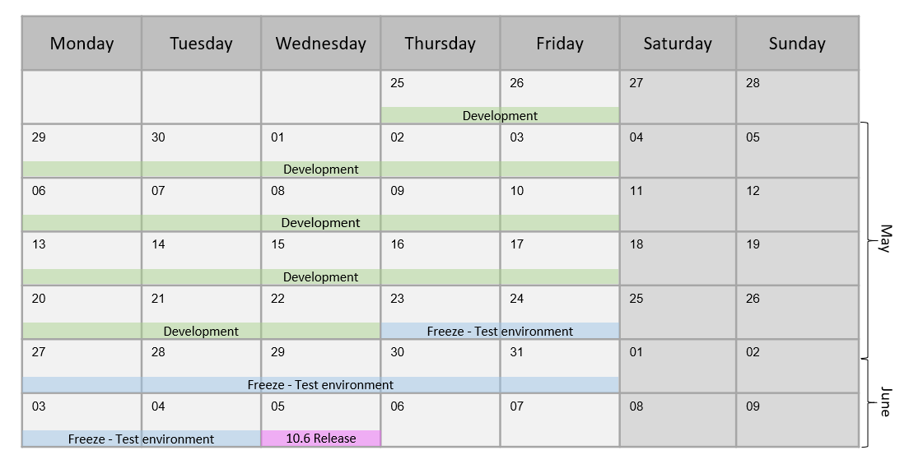
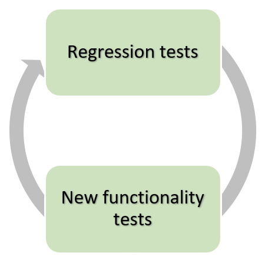
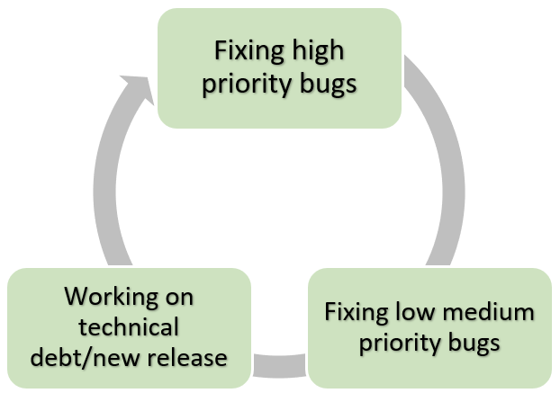
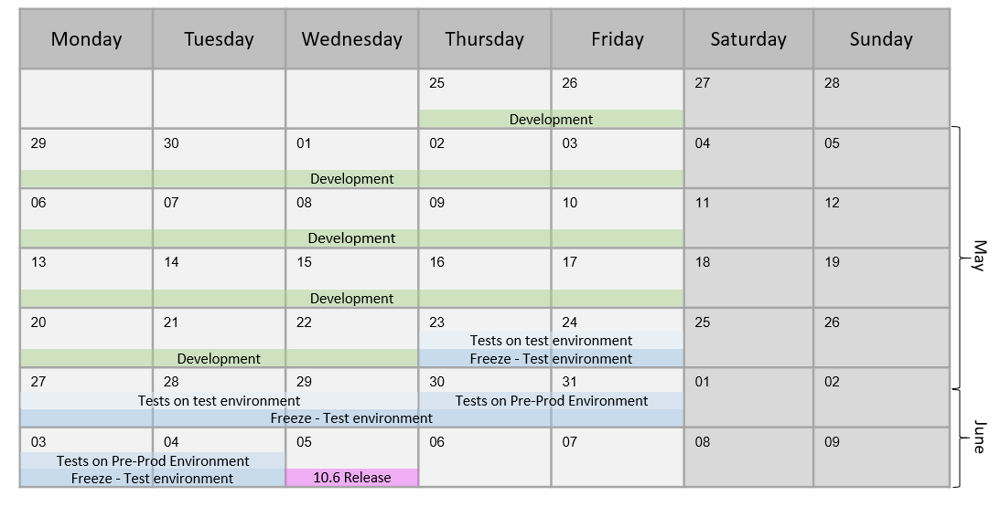

<!--Category:Article--> 
 

    <a href="http://productivitytools.tech/hello-decorator-how-long-does-it-take-to-paint-my-flat-lets-me-think-about-15-strawberries/"><a> 
           

    

# Setup the release schedule

The release process organizes the work of the whole IT. It is a framework that helps to keep delivering new features in good shape. This article describes the release framework for medium organizations (~100 heads). It focuses on development and QA. It doesn’t touch: code branching strategy, environments, test automation, meetings which should be performed during each phase.

<!--more-->

## Setup the release process 

Coming to the new company always brings new challenges and surprises. Joining EcoVadis also bring a couple of them. One of them was the release process or to be precise lack of it. The company has 8 development teams spread between Poland, Tunis, and France. They are writing different modules in one application. This forces them to deploy the whole application at once. Having this architecture impose several limits:

- All teams need to be synchronized 

- Critical bug in one team could stop the whole deploy on production

- Change in one area could result in bugs in other areas

Without proper organization release process is chaotic. Everybody thinks that only small things left, to be corrected and everybody planning to go to production the next day but changing code in one place starts the butterfly effect which very often postpones the whole deployment.

The first thing which should be done in this case is to set up a calendar with the most important milestones which need to be achieved to go to production in a given date. We started with the simplest approach possible and we distinguished three phases:

- Development – developers work on new functionalities, testers on the daily basis tests increments. 

- Freeze – developers stop working on functionalities and focus on repairing and polishing application.

- Deployment – software is pushed to production

## Development

In our case, it was 4 weeks of work. During this time developers work on new functionalities which description is provided by the analyst. QA writes test conditions and checks parts of the application delivered by coders. During this time a lot of bugs are issued. To manage the process bugs should have priorities and only most important should be fixed. This is not a time to fix the one-millimeter distance between button and label unless this is critical for business. 

This phase should be finished with working software which can be accepted by-product owner to be shared with users. 

## Freeze

As making any development often cascading changes are done, we need to have time to stabilize new code and check the functionalities which weren’t changed and should work as previously. As written before, to the freeze phase we should come with:

 - working software, 

 - fixed all major bugs, 

 - tested new functionalities

 - group of medium and low bugs which are not business-critical

## Testers

Testers should start freeze with testing the new functionalities executing test conditions written before. This process will result in:

 - issues not found previously

 - issues found previously repaired previously but reappeared again

 - bugs regarding software which works correctly, but not in the way business wanted

Having 100 bugs during the development phase and 100 during the freeze is it not something strange, so freeze is important. 

After all test conditions were run (with success or not), testers should focus on the regression tests. The best way to do it is to use the test conditions form previous iterations, but often regression is done manually without any test conditions. In this case, testers should have great knowledge of how application had been working and test the most popular paths. Very often to define the scope of regression developers helps and informs which part application can be affected by their changes. 

## Developers

Developers start this phase by fixing bugs left from the development phase. As those bugs should be a small one, correcting them shouldn’t introduce new bugs in other areas of the application.

If any of the new high bugs will be found during the freeze, developers should switch to it to unblock further testing.

If all bugs were resolved or decided not to work on them, developers can work on additional tasks. We have two options: 

 - Technical debt improvements 

 - Next release functionalities

Those tasks, of course, cannot be performed on the same branch as the closest release.

## Freeze parts

We could have different phases of the freeze. We decided to split it into two parts:

 - Testing software on a test environment
 - Testing software on the pre-production environment

To be sure that software has properly quality we decided that two rounds of tests should be performed. To be sure about the correctness of the tests in our case on one environment we have test data and on the second we have a copy of the production database. This means that tests on the Pre-Production environment will be 99% similar to software that will run on production.

To the pre-production environment only chosen people (QA) have access and if any bug will be found there, needs to be reproduced by those chosen people on a lower test environment. Only then the developer can confirm that it is really a bug and fix it.

## Deployment

This is a simple technical task to push software on the production, but it is important to put it in calendar as often this is performed by a different team, and for them, this could require some preparation steps.

## Edge cases
### What if the software is not ready during the freeze day?

We could use two approaches

#### Postpone freeze day

*Advantages*

- It is simple – moving one day, give us one more day to develop

- If the team worked very hard to finish, and they really need one day they have a positive feeling that their effort is respected

*Disadvantages*

- In the long term its looseness the motivation to finish software till the deadline

- often leads to postponing not one day, but two, three and more,

- could break calendar, for example moving everything one day could lead to having deployed during a free day

#### Descope functionality

*Advantages*

- It forces teams to proper scope functionality which they want to deliver 

- It allows IT to be predictable (most of the functionality will be delivered on time)

*Disadvantages*

- Require changes in code which could result in bugs

- Delay delivery and tests

### What if the critical bug will be found just before deployment?

It is highly unlikely, after two weeks of testing, if a critical bug was found it means that we made something wrong before. But if it will happen usually coders remember right now code so well that fixing it usually takes couple hours and it is done the same day as found.

If not, unfortunately, the release needs to be postponed, one day should be enough. 

