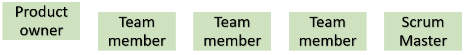

<!--Category:Article--> 
 

    <a href="http://productivitytools.tech/description-attribute-value/"><a> 

    

# Does the scrum team really exist

For a couple of years right now Scrum is the major direction in which all companies would like to go. This is trendy, and the whole IT says that implementing the Scrum approach will result in better software, more happiness, and all other good things which could happen in IT. 
<!--more-->
I was also part of the project in the big company during which we tried to implement pure scrum according to the book. The company hired one of the best Scrum consultants in our country and allow us to make all necessary changes, also not looking at the deadlines. Our main goal was to become a Scrum team. We ended as in other companies – after 1 year of trying we were scrum alike team which needed to make some compromises to make it work. 
Scrum introduces some ceremonies practices and other stuff. I would like to focus only on how I understood the team organization and comment if it is really working.
In scrum, we have two major roles and one additional which should disappear when the team will be mature enough. Those are:

- Product owner – the person responsible for the product, have all information about functionality, can decide what we are doing next, and how it should work. Often needs help from team members to understood the complexity of functionality, but still, he is the one who can answer any question. He or she can work in two different modes.  He can be fully working with the team, or just give tasks and check if assignments to the team were done correctly. He is on the same level as other team members, but as he is deciding and requesting functionality in our hierarchical minds he is a little bit above the team.

- Team member – team member should be like a swiss knife - multifunctional. If an application has frontend and backend, the team member should be full-stack and after finishing coding, he should write documentation, write test conditions, test functionality, and finally deploy software on production. 

- Scrum master – advisory role. The person should guide the team on how to work in scrum and resolve all impediments which they have. What is the impediment? It is a soft matter, like difficulty in communication, lack of work visualization. He is not an adviser about technical issues nor managing the employees. When the team will learn how to work and are excellent in communication and delivering, this role is not so much needed. At this moment scrum master could say that his job in this team is done as they now are a fully independent team.

## Scrum simplification in a complex world
On the paper Scrum assumptions seem valid and rational, in reality unfortunately usually they don’t.

### Product owners
In nowadays complex solutions, it is super difficult to point single product owner. Applications or part of them doesn’t have one person who is responsible for it, nor have full knowledge about it. So companies are trying to fit in some way to the methodology choosing group of people and saying that this is the “product owner body” and they together will decide. This break whole concept as if we have two people in charge, then most of the decisions need to be validated with both. Each person has different knowledge and often different opinion.

In scrum, we should also have one product owner assigned to a team, but this is rarely possible. Nowadays we have more demand for developers than supply. So it is very common that every year in the IT/Business department special event is organized during which major projects are chosen and only those will be done during the next months. This IT manpower assignment results in changing the product owner for the team. So developers are more like contractors who are working on one business area this year and on different next year. 

### Team members

The full-stack employee is a very rare person. Usually, it even cannot be a real full stack because of organization structure. The worldwide trend is to make every application as a web solution. Big companies are resigning from desktop applications and moving all functionality into websites. This results in the specialization of the team members. Usually, we have employees focused only on the backend which is usually written in .NET or Java and another group of frontenders writing in React, Angular, or Vue.js. Very often those people don’t want to learn how to write the other (usually treated as worse) part. They more likely would like to learn how to improve skills which they already good in. So backenders learn DDD, TDD, databases, and others. Frontenders on the other hand, are trying to keep up to date with changes in framework, implement typescript, and propose a neat architecture for their solutions. 

### Deployment

Team members in the Scrum should also be able to push software on production, but this is usually done by a different team in the organization. It has of course rationales behind this. Managing the servers, high availability, disaster recovery is different knowledge that development and nowadays DevOps or infrastructure team needs hours of learning to know how it should be configured. 

### Team Leader

Scrum is also assuming that all team members are equal and those group of people doesn’t need any team leader. This approach missing a couple of points. First, no team leader structure can work only in a small organization. When IT consists of more development teams, we need to have a structure in which each team will be represented by a particular person during general meetings. The missing team leader also means that we won’t have anyone responsible for people development, no one will look for the team and try to motivate them, give them feedback and push to learn new technology or frameworks. And the last point is also important. The team without team leader works very well only as long as developers are fully committed to their work. So they really feel responsible for the product, for their work and the general success of the company. This could happen if we hire very good people, but often we are not in the comfort of having so mature developers and some lead which will show people the right direction and remind us about basic rules which helps a lot. 

## Summary

Scrum is a great framework I read books that it had worked in a couple of great companies that have the best people in the market. I tried to implement Scrum team organization already tree times and each company has their restrictions which don’t allow to make it pure. Still, Scrum had other great parts like ceremonies and working principles which are very good and in my opinion, just the team is difficult to set up according to the rules. 