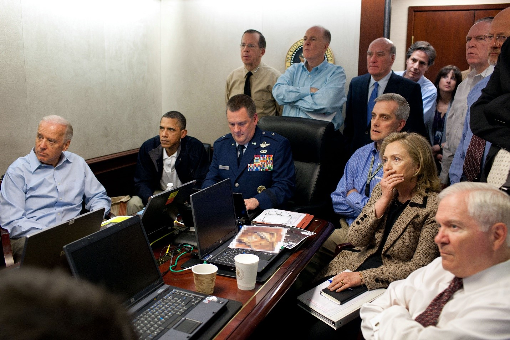
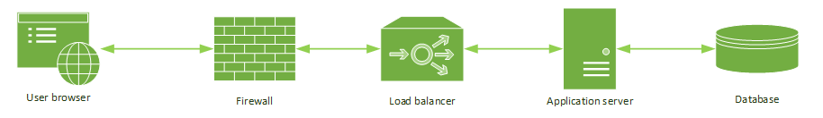
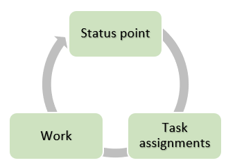
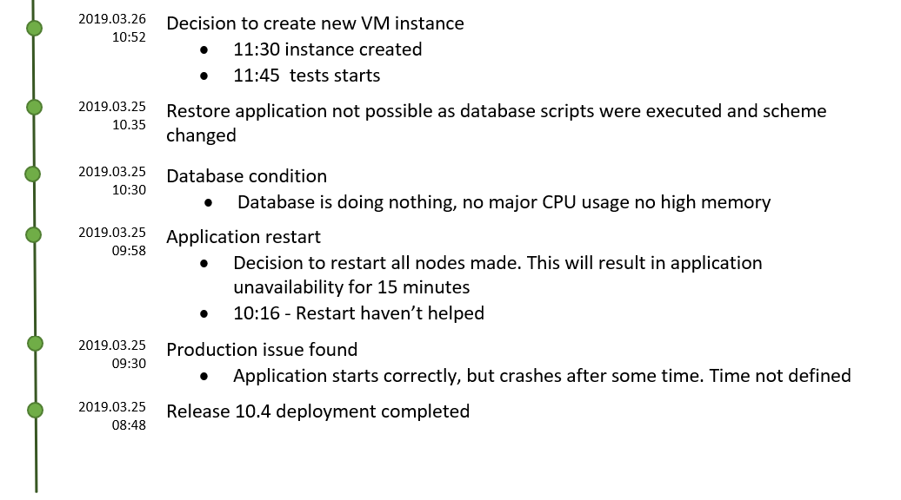

<!--Category:Article--> 
 

    <a href="http://productivitytools.tech/hello-decorator-how-long-does-it-take-to-paint-my-flat-lets-me-think-about-15-strawberries/"><a> 
           

    

# IT War Rooms

Every industry failures happen, but only in IT, we have so many incidents that affect so many people. We could list also hundreds of reasons why this is happening so often. This time although let’s focus on the actions which should be taken if something occurred and now, we are facing serious production issue. 

<!--more-->

## Failure

A lot of applications are deployed manually, during this process people make mistakes. The rest of the solutions are deployed automatically and, in those scripts, have bugs. For most of those situations, we know how to behave. Repeat steps, make code correction, and push again to production.  The most difficult cases are when we are facing a completely new issue which we don’t know what to do with. Serious failure is a situation in which something went wrong, we don’t have the simple answer on how to repair it. Usually, it also affects a lot of people. For example
 - application not starting at all without any information why
 - an application starts, but after some time it crashes
 - deployment went smoothly, the application is working, but pushed code were not properly tested, and every second it removes part of data from a database 

## War Room

When failure is detected, it becomes escalated until a person who thinks can manage the process of resolving the issue is found. It could be a release manager, engineering manager, or even an IT director. The important here is that this person needs to be properly placed in the organization, this means that employees need to respect him, and he needs to have the authority to make decisions. Let’s call him a **Leader**.

The leader needs as soon as possible to gather all people in one place which he thinks will help in resolving the issue. A list of people will be different for each application structure. 

If we have a very simple application like presented above, we need to have a lot of people to help

- Leader
- Developers – architect, technical leaders, senior developers
- Network engineer
- Operations engineer
- Database administrator
- Security engineer
- Tester 
- Recorder engineer

As you can see every application could require a group of employees to resolve the issue. (Think about more complex system, when we have multiple elements like Mainframe with the core banking system, integration layer and external systems which could influence the behavior of application)

## Action plan

After gathering all people in one room Leader again ask to describe the found issue. It is important to align all people and make sure that everybody understood what we are dealing with. Next, Leader listens to propositions on how to resolve the issue. All of them should be written in some visible place (wall, whiteboard). 

After this discussion about each of them starts, during the conversation required people for each action should be marked on the whiteboard. So, if one proposition requires reproducing the issue on other environments and it needs QA, Operations, and Database engineers all three should be pointed on the wall. 

The first part of the discussion should finish with a list of the most probable actions which could resolve the issue. The next part should assign tasks to concrete people. This agreement also should be written on the table. It is very important to know who exactly will be working on which task. It is also important from the responsibility perspective. If someone is clearly pointed out that this task depends on him, he will be more motivated to work on it hard. 

If possible, work should be planned to be done simultaneously. Very often we could work on the most probably issue on the production and try another approach on the test environment. Not running tasks at the same time, it is a waste of time.

After assignments leader should establish the next **status**. It is not a meeting as all people should all the time sit in one place and collaborate. It is a moment when everybody should stop working and rephrase and summarize everything that they have done. Those moments are important as if people start working on the tasks it could happen that they will turn in the wrong direction and in the stress situation no one will ask questions which could show that performed actions could be wrong. 

During the status again we are going through the list which is visible for everyone. After one hour of work, this could be already heavily crossed, or with new ideas. During status, everyone should synchronize and be sure that they understood what is on the wall.  

We are repeating the steps until the issue is resolved. 

## Recorder engineer
Most of the roles are pretty much straight forward. We need database administrators to help us restore database, restart the instance and other things, network guys to turn on and off servers, redirect traffic to chosen instances, and others. 

One role could not be so clear. Record engineer it is a person which should wrote down every action which was performed. It is done for two reasons 

- When difficult issue is found, a lot of ideas are tried. To not waste time for implementing the same solutions which hadn’t have worked before, we need to have written exactly what we have done previously

- After the incident analysis of the situation should be done and all we should check if any of performed action shouldn’t been reverted. Without clear list it could be difficult to remember about every change done.

A Report engineer should have basic knowledge about development infrastructure and security as he needs to know what he is writing. He needs understood everything what people in the room are talking and if something is not clear he must ask questions to make it obvious.  

Below you can find an example of the report which I was creating during an outage.  

Below you can find an example of the report which I was creating during an outage. 

