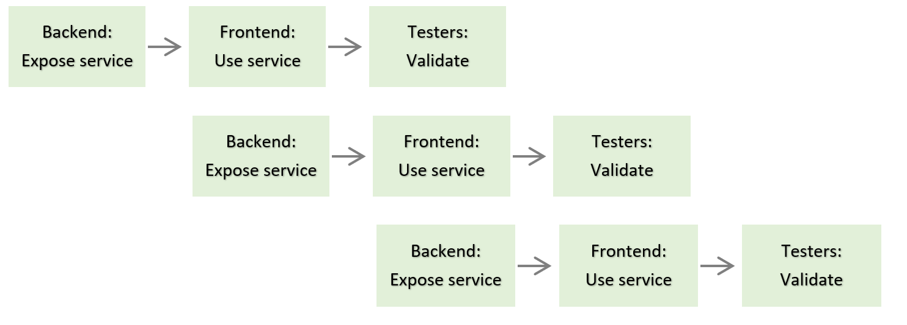

<!--Category:Article--> 
 

    <a href="http://productivitytools.tech/the-most-expensive-t-shirts-in-the-world/"><a> 
           

    

# Grow carrots in Development team

Every time visitors (employees from other sites) come to the Warsaw office they are guided through open space to better get to know coworkers.  Once, one of my colleagues from the different departments had a guest. Of course, the standard round was made and when she stopped ahead of development teams, she introduced us and, at the moment, asked the question: 

- And those are developers. So, Pawel what are you actually do?

As we know each other for some time, the question shocked me a lot. I cannot imagine she doesn’t know anything about my teamwork. I answered:

- Most of the time we grow carrots.

## So, what developers generally do?

Let’s take one example which will help us to understood developers' work. Let’s imagine we are the team responsible for creating a payment module in the internet banking website. From the user perspective performing transfer is a simple operation. Users fill required data and after clicking the Send button, the transfer is made. 

It seems simple, but to provide a clear interface and good user experience we need to perform a lot of tasks. 

## Monthly routine

Every couple of months to the development team, the specification of new functionality is sent. Let’s assume that the new expectation is to have a search field on the money transfer page. The search will help to input the required data into the form. The people responsible for the transfer page, meet with the IT representative and they start describing the functionality. In the beginning, it looks very simple: just a text field that will autocomplete the recipient of the transfer.  

Of course, nothing is easy. During the analysis we are asking questions like:
- Does the search should look at the history or only in the address book?
- How many items in the autocomplete box should be shown?
- Do we accept the mouse click or enter button?
- What set of data will we show in the autocomplete?
- Should we show additional data if we have more than one recipient with the same name (our friend has two accounts)?
- How autocomplete should look like?
- And others…

When all questions will be answered and visualization of the screens will be prepared, "developers" can start working.  It means that the development team takes functional specification, graphics, and split feature into small tasks which can be distributed across team members. 

Developers is a very general term. Usually, development teams consist of:

- Frontend developers – responsible for the final webpage view
- Backend developers – responsible for the application business logic
- Testers – responsible for validating if everything is working correctly
- Analysts – responsible for validating if functionality meet business expectations

### Frontend developers

This group is responsible for the visible part of the application so for the icons, colors, nice behavior of the components, pop-ups. They also need to integrate with the services which are exposed by backend developers.

### Backend developers

They are responsible for exposing services. Service is a small functionality that is created to perform a task. For example, in our case, we could have a service that will return the list of contacts.  

### Testers 

Everything which will be created by Frontend and Backend developers needs to be checked. Testers or Quality Assurance team checks the solution before sharing it with the users. They are trying to break the new functionality simulating different users’ behavior. 

### Analysts 

This is a supportive role that should find an answer for the topics which are not precisely described in the documentation. They also prepare documentation that describes the final solution. 

## The process 

Delivery of the functionality can take a couple of days or even a couple of months. The development team during this time make repeatable interactions. Backend exposes services which frontend uses, and testers validate. 

The process continues until all tasks in a given functionality will be finished. All actions overlap so when one functionality is tested another is created at the same time.

         
             
When all requirements are implemented and tested, functionality is treated as finished, and we can share it with end-users.

## ## You grow carrots so probably you also can set up a printer?

Usually, we know how things around us are made. We have basic knowledge of how houses are built, we know how food is cooked, we know how our cars are assembled. It will be also good to have a very basic idea of how applications which currently are around us build.
