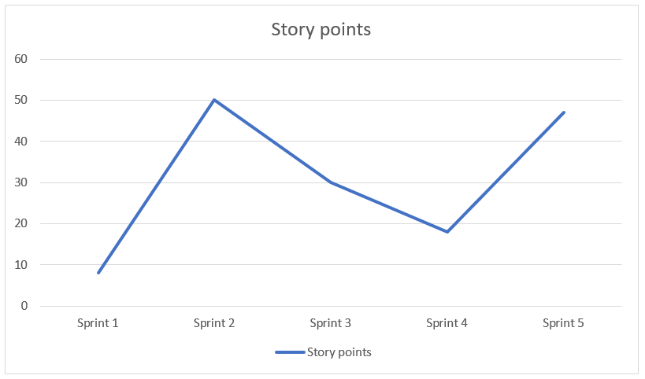

<!--Category:Article--> 
 

    <a href="http://http://productivitytools.tech/hello-decorator-how-long-does-it-take-to-paint-my-flat-lets-me-think-about-15-strawberries/"><a> 
           

    

# Hello decorator, how long does it take to paint my flat? - Let’s me think, about 15 strawberries.

Agile introduced estimating work in the story points. Story points estimate complexity of the project, not the time needed to finish task. 

<!--more-->

In theory, it makes sense. We don’t know which team member will be doing the task so estimating in hours can be not accurate. A senior developer will resolve items in a couple of hours, junior maybe will need more time. So, we are estimating the complexity of the tasks and later we will decide who will be working on it.

## The theory is great, and what is the practice?

I was in two teams where we were trying to implement story points. Once we had two major polish agile consultants to help us. Both times, unfortunately, we decided to go back to man-days. What are our learnings?

## Business needs

When I am asking for the car repair after the accident, I am not interested in how much complicated the process will be, I just want to know when and how much it will cost. In the IT situation is the same if the business asks for a new feature he is not interested if it will be complex or not, he wants to know how much he will need to wait for it and how much it will cost him. Story points are an abstract currency which tells him nothing. 

## Roadmap planning

In every company IT together with business plan major features which should be delivered in the next year. So even if team estimates in story point one day, they or their team leader will be asked how much time they need to finish.

## People resistance

Story points is abstract currency. The idea is that you start with some exchange rate (for example 1SP is simple control) and during the time team will synchronize and teach each other what means 1SP, 2SP and so on. The process is difficult, and it doesn’t have a quick feedback loop. Often you need to spend a couple of months to set up some rules and understanding. And let's be honest, usually, our teams consist of different kinds of people. We have highly motivated guys, which will be focused on the task for the half-year, and we will have detractors which will vote for resigning from new estimation methodology.

## Inflation & Deflation

To introduce story points, you are using them to estimate the first functionality for the sprint. After iteration finishes you check how many story points you delivered. This is the base for the next sprints. During the next planning, you take into sprint no more than previously finished. Seems simple. Unfortunately, we are facing deflation and inflation of the story points. During a couple of months, one story point starts to mean a completely different value. In the beginning, in the sprint, you could deliver 20 story points but next sprint it could be 12 or 90 with a similar job done.

## Task assignment

Story points show the complexity. The idea is that the senior developer will finish the task faster than the junior one. But I don’t agree with that thesis. Most of the time work like adding the screen, calling endpoint returning data is done in a similar time by all developers. With more complex tasks I can agree that seniors could be more efficient than junior, but for these tasks usually, we are doing assignments during the estimation as this will be the most difficult item in the backlog. 

## Hidden productivity stealing’s

Story points also hide very important information about the cost of work. If you say that something is 4 SP it is just a number you cannot say that this is long or short, but if the developer tells you that changing the label on the screen costs 8 hours, you could start asking questions. This often leads to hidden difficulties that you can fight against to improve productivity. 

## How much the work costs?

Mature developers should understand the cost of tasks. I am expecting senior developers to answer a question about the time needed. It doesn’t need to be very precise but using story points won’t let developers improve in this area.

### Agile estimation is not easy, but trying it learns you a lot.

