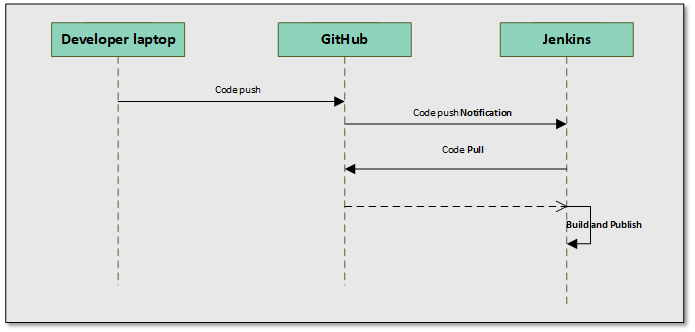
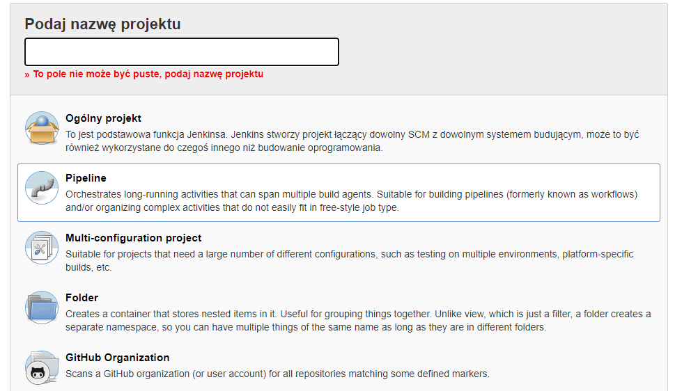
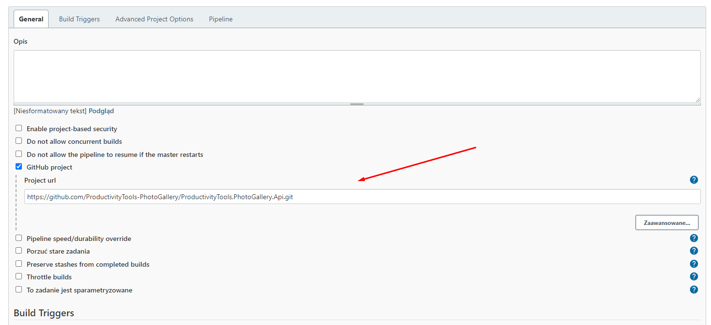
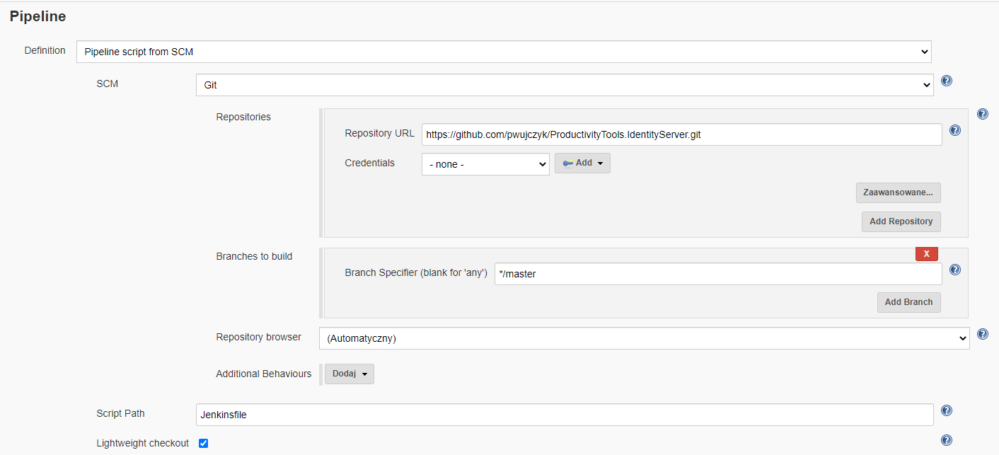

I was trying to setup simple CI CD configuration. I though that my case is pretty common. Unfortunatelly whole Internet doesn't describe whole case at once. So here is the tutorial.

Use case:
- Pushing code to GitHub should invoke build and publish process on my home server
- Continiuous delivery needs to be placed in the git repository
- Build server is jenkins as it free



## Jenkins

### Plugins
I am not sure exactly which plugins are needed, but I have following installed
- GitHub API Plugin
- GitHub Branch Source Plugin
- GitHub plugin
- Pipeline

### Definition in code repository
Jenkins allow to build CI definition in different ways. Current most popular approach is to use **Pipeline** project with the Jenkinsfile which contains CI definition.

### Project Type 
To use Jenkinsfile chose **Pipeline** project type



### Github project



#### Jenkins pipeline configuration

In the Pipeline chose **Pipeline script from SCM** and fill couple fields as showed on the picture below. From this point you can invoke job on jenkins and job should download jenkins file, and perform actions in the pipeline file.




#### Jenkins file
It contains build definition. Three example steps below. This is pretty simple. One of my full jenkins file is [here](https://github.com/pwujczyk/ProductivityTools.IdentityServer/blob/master/Jenkinsfile). Put file (jenkinsfile without extension) in the main directory of your project repository.

```
pipeline {
    agent any

    stages {
        stage('hello') {
            steps {
                echo 'hello'
            }
        }
        stage('clone') {
            steps {
                // Get some code from a GitHub repository
                git branch: 'master',
                url: 'https://github.com/pwujczyk/ProductivityTools.IdentityServer.git'
            }
        }
        stage('byebye') {
            steps {
                echo 'byebye'
            }
        }
    }
}

```

#### Github push

In your project configuration you should add webhook. The address should be your jenkins address followed by */github-webhook/*. Of course you need to have server available from Internet. On the example below I forwarded 8080 port from my router to internal network. 

https://productivitytools.tech:8080/github-webhook/

.

#### Receive the push by project

Last step is to add information about push to Jenkins file. Modify the definition and add **properties([pipelineTriggers([githubPush()])])**. 

```
properties([pipelineTriggers([githubPush()])])

pipeline {
    agent any

    stages {
        stage('hello') {
            steps {
                // Get some code from a GitHub repository
                echo 'hello'
            }
        }
        stage('clone') {
            steps {
                // Get some code from a GitHub repository
                git branch: 'master',
                url: 'https://github.com/pwujczyk/ProductivityTools.IdentityServer.git'
            }
        }
        stage('byebye') {
            steps {
                // Get some code from a GitHub repository
                echo 'byebye'
            }
        }
    }
}

```


## Bitbucket

Install **Bitbucket Push and Pull Request** plugin https://plugins.jenkins.io/bitbucket-push-and-pull-request/