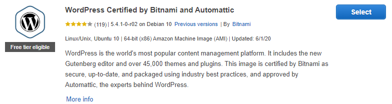
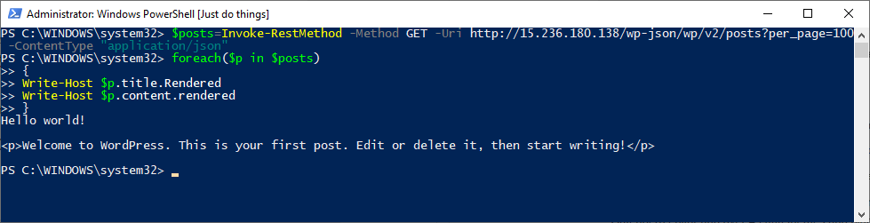
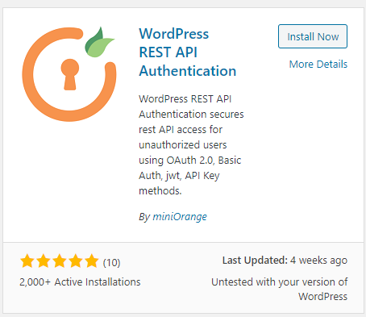
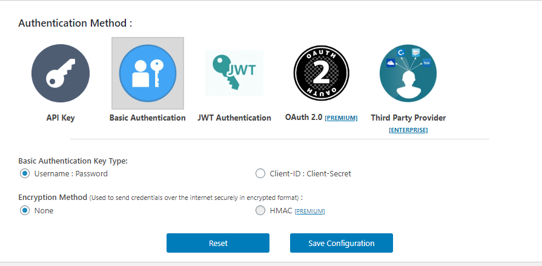
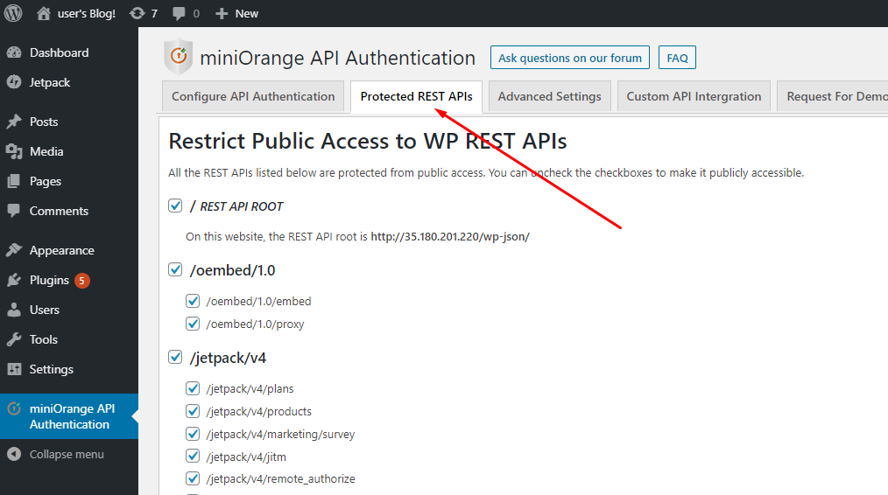

<!--Category:C#--> 
 <p align="right">
    <a href="http://productivitytools.tech/description-attribute-value/"><a> 
</p>
<p align="center">
    <a href="http://productivitytools.tech/">
        
    </a>
</p>


# Publish post to Wordpress through API

This article describes how to configure Azure Bitnami Wordpress instance to be able to publish articles using API.

The article describes the process using a clean version of Bitnami Wordpress




Clean version fo WordPress allows us to retrieve posts using API with simple get.

```powershell
$posts=Invoke-RestMethod -Method GET -Uri http://15.236.123.60/wp-json/wp/v2/posts?per_page=100 -ContentType "application/json" 
foreach($p in $posts)
{
	Write-Host $p.title.Rendered
	Write-Host $p.content.rendered
}
```
We don't need to provide any credentials. It is working by default.



Unfortunately, it is not so easy to publish a new post using API. Even if we add authorization information following code will return ``401 Unauthorized``.

```powershell
$base64AuthInfo = [Convert]::ToBase64String([Text.Encoding]::ASCII.GetBytes(("user:9pnCnk4Oij2K")))
$header = @{
	Authorization=("Basic {0}" -f $base64AuthInfo)
}

$params = @{
    title = "NewPost1"
    content = "Post published with API" 	
    status = 'publish'
    }
$params1=$params|ConvertTo-Json

$newPostAddress="http://15.236.180.138/wp-json/wp/v2/posts"
#$updatePostAddress="http://15.236.180.138/wp-json/wp/v2/posts/$postid"
$response=Invoke-RestMethod -Method post -Uri $newPostAddress -ContentType "application/json"  -Headers $header -Body $params1
````
First let's enable simple user:password authorization. Install **Wordpress REST API Authentication** plugin 



In plugin configuration chose **Basic Authentication** and **Username:Password** option. Save configuration.



Make a backup of file **httpd-app** 
```
cp /opt/bitnami/apps/wordpress/conf/httpd-app.conf /opt/bitnami/apps/wordpress/conf/httpd-app.conf_bak
```

Edit **httpd-app** file (/opt/bitnami/apps/wordpress/conf/httpd-app). Adding the rewrite rule:
``RewriteRule .* - [E=HTTP_AUTHORIZATION:%{HTTP:Authorization}]``

```
nano /opt/bitnami/apps/wordpress/conf/httpd-app.conf
```

I propose to replace the content of your file with the data provided below.


```
<IfDefine USE_PHP_FPM>
    <Proxy "unix:/opt/bitnami/php/var/run/wordpress.sock|fcgi://wordpress-fpm" timeout=300>
    </Proxy>
</IfDefine>

<Directory "/opt/bitnami/apps/wordpress/htdocs">
    Options +MultiViews +FollowSymLinks
    AllowOverride None
    <IfVersion < 2.3 >
        Order allow,deny
        Allow from all
    </IfVersion>
    <IfVersion >= 2.3>
        Require all granted
    </IfVersion>


    <IfDefine USE_PHP_FPM>
       <FilesMatch \.php$>
         SetHandler "proxy:fcgi://wordpress-fpm"
       </FilesMatch>
    </IfDefine>


   RewriteEngine On
   RewriteRule .* - [E=HTTP_AUTHORIZATION:%{HTTP:Authorization}]
   RewriteBase /
   RewriteRule ^index\.php$ - [S=2]

   # uploaded files
   RewriteRule ^files/(.+) wp-includes/ms-files.php?file=$1 [L]

   RewriteCond %{REQUEST_FILENAME} !-f
   RewriteCond %{REQUEST_FILENAME} !-d
   RewriteRule . index.php [L]

    Include "/opt/bitnami/apps/wordpress/conf/banner.conf"
</Directory>

Include "/opt/bitnami/apps/wordpress/conf/htaccess.conf"
```

Restart Apache

```
sudo /opt/bitnami/ctlscript.sh restart apache
```

Now you could expect to be able to post data. Unfortunately this at this stage usually it is not working. The missing step is to open the **Protected REST APIs** tab. You just need to open it to change some internal plugin configuration. 



After this, step you can post data with the code provided above.

From now on also if you would like to get information you need to provide user credentials, so code from the beggining should be changed to:
 
 ```powershell
$posts=$null
$base64AuthInfo = [Convert]::ToBase64String([Text.Encoding]::ASCII.GetBytes(("user:FhIwtEKNCRF7")))
$header = @{
	Authorization=("Basic {0}" -f $base64AuthInfo)
}
$posts=Invoke-RestMethod -Method GET -Uri http://35.180.201.220/wp-json/wp/v2/posts?per_page=100 -ContentType "application/json"  -Headers $header
foreach($p in $posts)
{
	Write-Host $p.title.Rendered
	Write-Host $p.content.rendered
}
 ```