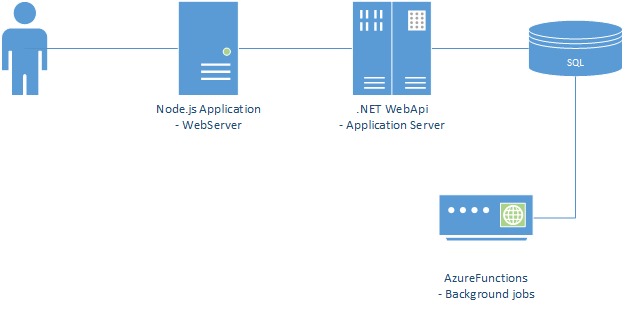
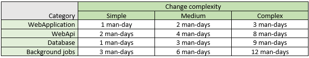
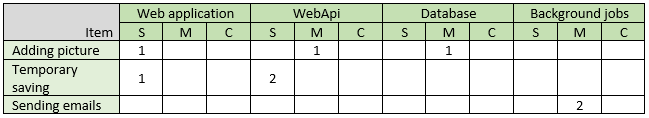
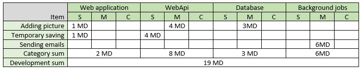

<!--Category:Article--> 
 

    <a href="http://productivitytools.tech/send-rocket-into-space-in-parts-how-to-estimate-large-projects/"><a> 
    

    

<!--og-image-->

# Send rocket into space in parts - how to estimate large projects?

The job posters are full of requests for agile, scrum coaches. Now every manager, team lead position in a job description has information about agile. The current trend is very clear. We are trying to deliver software in small steps. We took functionality, tear it apart into the smallest user stories possible and finish one by one. IT commits only to the work planned for the next two weeks.  

This approach is working. Business sees how developers deliver software. IT is predictable and everyone is happy. 

### ...Until something bigger happens
<!--more-->
You could be requested for managing a project which is much greater than you usually do and additionally you are asked to answer for a simple question: how much it will cost? 
Your current agile methods are not working anymore. You cannot analyze the solution and write the exact method names for every task. You think that need to perform one hundred sessions of estimations in one week to give final number.

## Estimator

To meet your estimation deadline you need to use a different tool. The estimator is usually an Excel spreadsheet that returns you a number of man-days that are needed to deliver functionality. It contains a different conversion rate for different parts of the system. 

Having a simple solution we could differentiate at least four categories
- WebApplication
- WebApi
- Database
- Background jobs

If the solution is more complex we could split one of the elements in more gradual items like an application layer, database layer, and so on.

For each category, we are setting up 3 complexity levels: simple, medium, and complex. For each level we setup the man-days' which are needed to finish the task from the given category. This is, in fact, a crucial part of the process. Setting values wrong in this place will result in some strange estimation. 

Next, we create a table that will help us summarize the effort. We should have the same categories and complexity. 
We take a business requirement and add rows in our table. Filling the crossing cells with a number of changes.

Let's analyze the example below: we are thinking that adding a picture to our application will require one simple change in the web application one medium in the web API and one medium change in the database.
Saving form temporarily, on the other hand, will require a simple change in the web application (this is adding a simple button), two simple changes in web API - this is a modification of two controller methods.

If the estimated functionality is big this table could have a lot of rows.

The last step is to calculate values.

In our simple example, we estimate 19 MD of development cost. It is far from perfect, but it gives a rough estimation in fast way. During calculation you do not need to think about internals you just setup amount of services, database, buttons change. Usually it is the best approximation you could have in short time.

## More advanced estimator

In the real situation we should take more variables into considerations:
- In the example we estimated only development, probably you would like to estimate also the QA, DevOps, Management, Analyst work. Those are different categories
- To have more flexibility you could use an additional level of estimation which is reuse. So you could have complex change but you will reuse it from the previous change. Than estimator will reflect more reality
- The estimator is used to give a number in a fast way. By rule, it is not very accurate. You should add a contingency to be sure that you will have time to finish tasks. I saw 20% as an additional time buffer
- An estimator should contain more information about change like area, category, item description. If it will be missing this the next week we won't remember what it was about