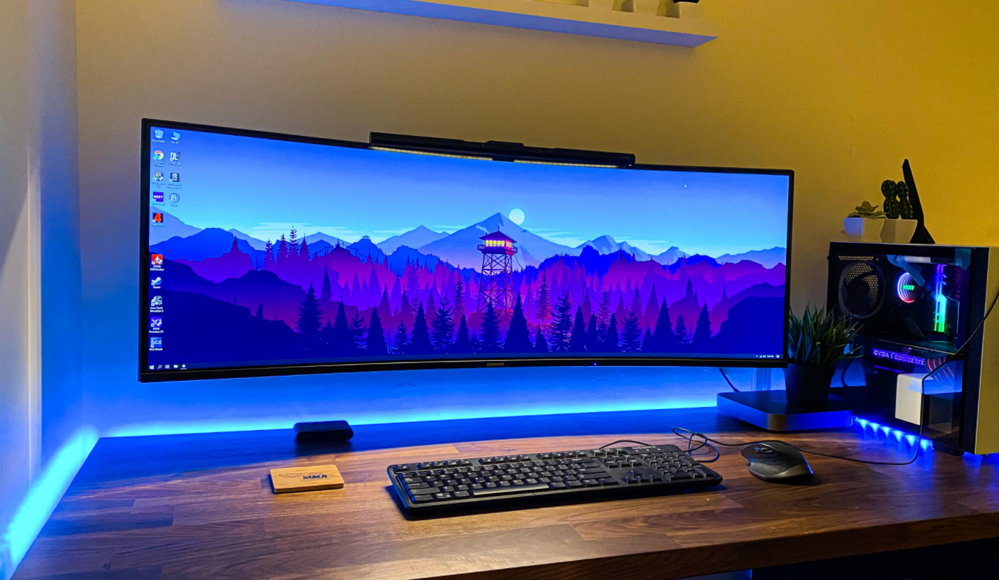

<!--Category:Article--> 
 

    <a href="http://productivitytools.tech/send-rocket-into-space-in-parts-how-to-estimate-large-projects/"><a> 
    

    

# Efficient development team

<!--og-image-->

To deliver software, the team needs to be organized. Every team is different and each leader will be managing team individually. From my experience, I think a couple of things are more important than others.

*So if you would like to do only one thing in your team:*

## Describe what needs to be done

Usually, people come to work. They would like to login to the computer to make what we are expecting from them and go home. But when work is not correctly described they are lost. They are trying, asking, or wasting time looking for a task. We can say that if something is not well-described, developer will ask. Maybe yes, but not all of us have the same soft skills. Also not all of us are all the time available.

This is also a very important point in all methodologies. Waterfall - structured documentation. Scrum - structured User stories.

*If you would like to do two things to your team*

## Split functionalities into smallest chunk possible

Everyone likes to mark something done. Little successes are important if we will finish 10 small tasks we will be happier than if we will finish only half of the big task. 

Also during the splitting of the tasks additional ideas, questions will occur. Work will be more organized, as more details of the functionality will be added.

If you did those two in your team it is already good. Those changes are not something which can be introduced in one week. If you would like to push it further:

## Test just after development

Small tasks are great, still, it is important to test them on the environment just after the development. The test needs to be done in the environment and it will be good if it will be performed by a non-developer who did the job. 

For different companies, different percentage of bugs will be found, but for sure they will be. If functionality will be tested just after work developer still has the whole code in his memory (brain) and will fix it much faster than in two days.

If you are at this stage, development should go pretty smoothly. If you would like to introduce the fourth improvement

## Measure developers work

Each developer needs to know how much his work costs. When you will start estimating your work it will occur that to write one line of code you very often need to spend 1, 2, 4 hours. Developers start to understand that creating the Pull Request, adding a new column to the table, creating new permission is not 0-time activity. 

Knowledge about the cost of work allows the whole team to make many accurate estimations and this is not important for business this is important for the team. It is much better to estimate something for 4 hours and finish it in 3 or even 5. Then to estimate something to one hour and did it in 5. Correct estimations give more satisfaction for the employees

Knowing how much work cost it is a level that a lot of developers will never achieve. Let us do another step.

## Implement traceability

Who did this fix? How much cost whole functionality not only one task. How much developers spend on bugs and how much on functionalities. 

Traceability is very often provided by tools. Jira, Azure DevOps gives you a lot of data. Still, you need to learn how to use it. Start by asking yourself the questions above. Can you answer them? But please do not estimate. At this point, you need to know exactly. Who, when, and for how long. You need to have it because you should present it to the team and say
- This sprint we spend 40 hours fixing bugs from the previous release
- No way, we did something but for sure not 40 hours
- Please look this is a data

## Retrospective

Your developers are working, they know what to do they estimating the work, maybe this is not accurate, but still. This is a moment when they need to help themselves to improve. Retrospective which Scrum describes is the right place to do it. Make a simple place to put all ideas. It could be mail with a specific subject, which will be reviewed during a meeting, it can be the slack channel. Start by putting their elements and discuss them during the meeting. After some time developers will start adding their elements to it. 

Your team is self-improving, they are deciding what to do and how. What next?

## Write procedures

As more topics you will have during the retrospective, more establishments will be done. Now it is time to keep them. 

Sometimes I hear, we are not writing those things. If we decide something and it will catch up it is ok, if not we are trying something different. I have another opinion, employees decide, but we are people, we forget we sometimes do something wrong. I am trying not to loos minutes of brainstorming with the team. If they decide something, let us try to do it. If we haven't succeeded during the first-week lets try again. 

To remember all of this we can write procedures that we should do in a particular situation. Meeting notes also will work. 

## What next? Try not to be bored

Experiment. At this stage, you should be very good at delivering. Your developers should be happy and satisfied with the tasks finished. Now it is time to try something new, not to be bored. Try new technology, new working schema, if you aren't doing pair programming, try it. If you are doing it all the time, try working alone. 

