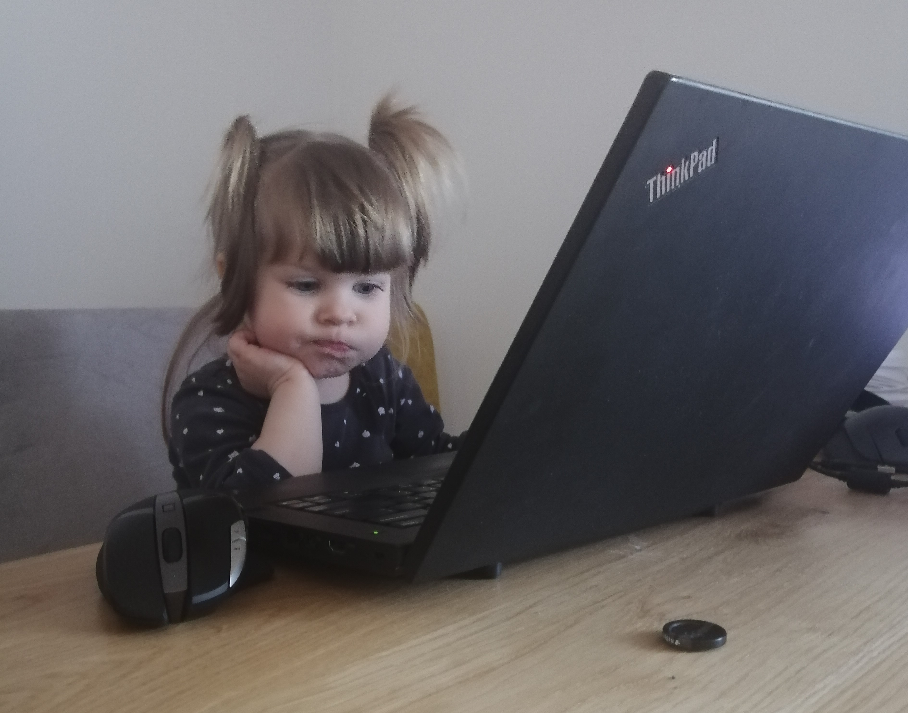
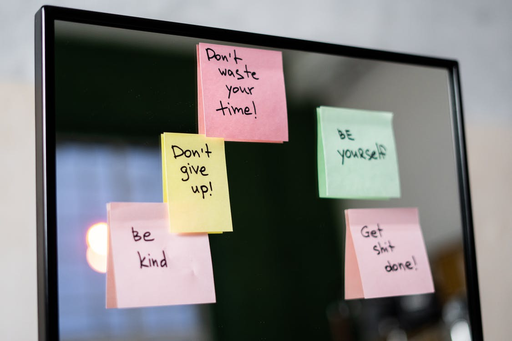
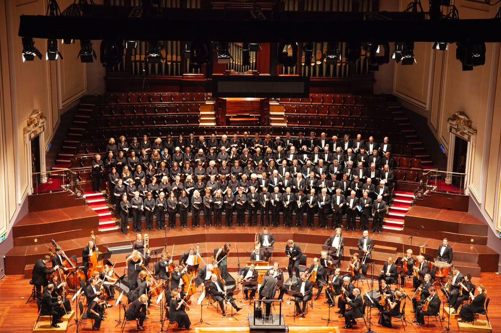
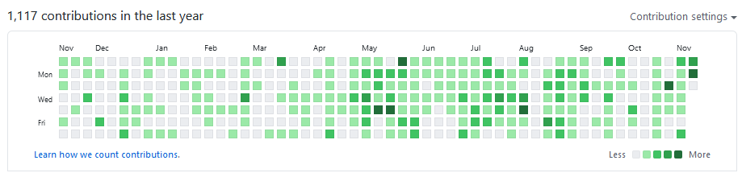
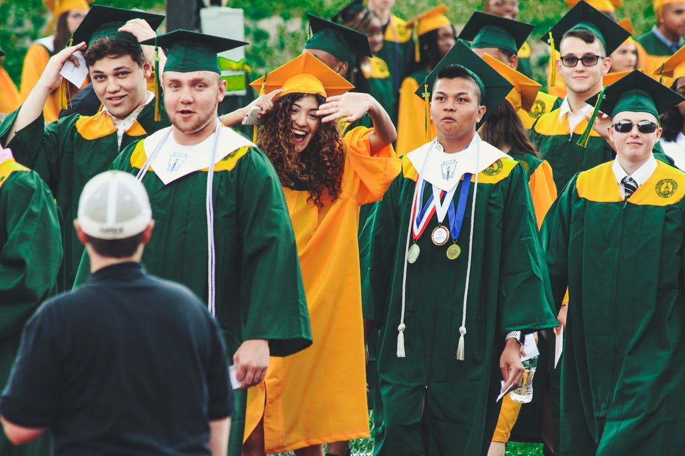
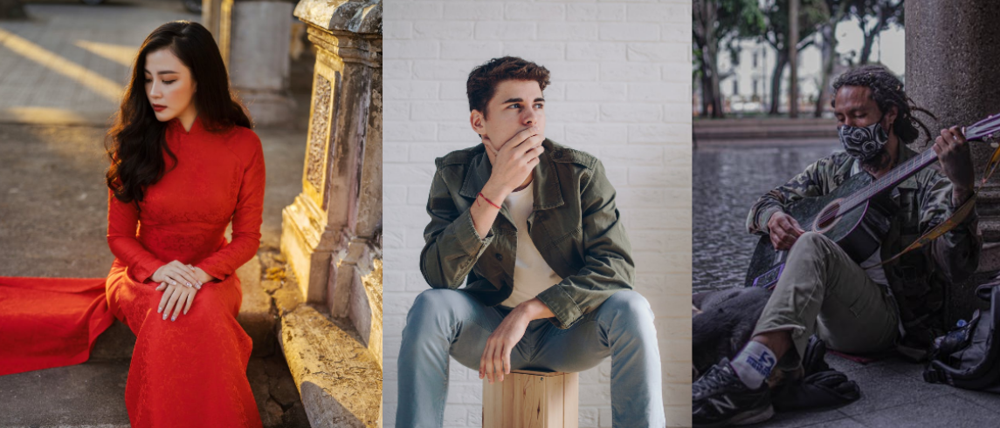
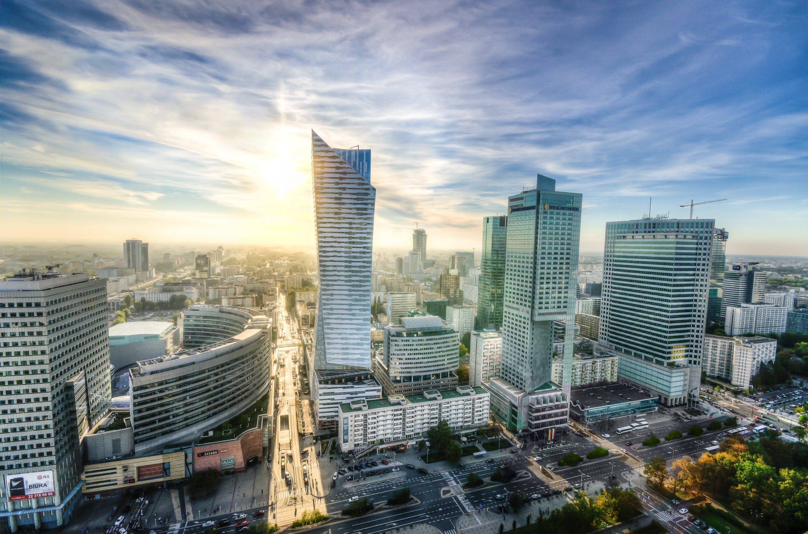

<!--Category:Article--> 
 

    <a href="http://productivitytools.tech/send-rocket-into-space-in-parts-how-to-estimate-large-projects/"><a> 
    

    

# My CV was rejected. Again!

<!--og-image-->

Changing the job is one of the most stressful situations in our life. We are stressed when we are reviewing job offers, when we are sending CV and finally during the interview.

Often we are sending the CV but we are not invited to the meeting. Why? I performed already 144 interviews for technical positions. I reviewed 250 CV. Lets review the most important part of each resume.

<!--more-->

## Photo

Today I reviewed five CV's, in couple hours I will be discussing them with HR. It is much easier for me to remember about the resume which I can connect with some face. Of course in the future we will have similar conversations with other people and in those cases photo is also very helpfull.

I don't care if it is professional photo, or one from the last vacation, but it is much appreciated if it is up to date. If I have CV with a guy which has long hair and beard, but on the meeting I am seeing completely bold candidate it is just difficult for my head to connect those two people.

## Summary

I have never looked for just interesting candidate. I always have some expectations, which are reflected in the job description. If your CV have couple lines of summary it helps a lot. 

*Full stack .NET developer with 5+ years of experience in designing, developing, 
testing and maintaining web and mobile applications for corporate and retail 
customers in the financial sector.*

If I don't find this intro, I need to make it myself looking into the experience, calculating years and so on. Of course I will do it, but I think it is better if candidate will write what he would like me to focus on the most.

## Skill list 

Similar to the summary, ususally when somebody is applying for the developer position, in his previous job he was coding. Important part was what technologies he was using. Making it in bullet list makes whole process much easier.

## External links

This is very often the first thing which I checking. If somebody put link to external page I am always checking it out. If it is a Linked In profile I validate if data in CV and in the portal is the same. If it is some custom made page, blog I am quickly check them out. 

### Github

This is the most important external link from whole CV. If somebody puts it I am always reviewing the code. Unfortunately often link is present, but only couple commits through last year was done. What does it mean? Candidate is trying but doesn't have time? 

## Certifications

For some time certifications doesn't mark the best candidates. We have many people on the market which are just passionate developers and doesn't have any document of the completion.

On the other hand I had one candidate who had 10 certificates from SQL and he didn't remember what is an index.

## Design 

I am looking for developer not graphics designer the CV won't be showed in the gallery in Luwr. But still if CV is nice it is easier for me to read it. When I receive document written in small consolas without proper spacing, It is much difficult to reviewed it. If will be not sure if I should invite candidate or not CV design should be this last element which help me decide.

# Experience

Experience is so low? Yes. Because it is the longest part of the CV. It allows to go into details about the candidate. Company names are important. Currently I have some knowledge what is done in a lot of companies in my city. I know what kind of issues they have. Very often this helps candidate as couple years in big company will result in different experience than couple in startup. 

# Additional information

To be honest. I am not focusing on availability on hobby and other staff. Hiring is so time consuming that I can wait for candidate 3 months, also during the interview we have so much topics to discuss that very rare we have a time to discuss about hiking. 

