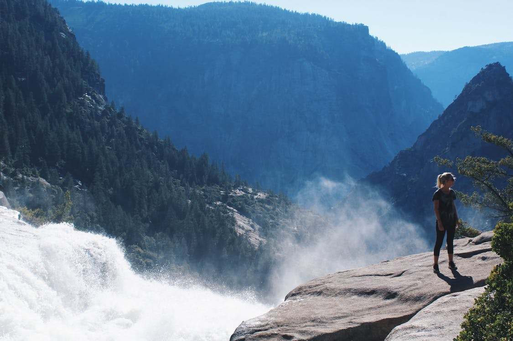

<!--Category:Article--> 
 

    <a href="http://productivitytools.tech/send-rocket-into-space-in-parts-how-to-estimate-large-projects/"><a> 
    

    

# My CV was rejected. Again!

<!--og-image-->

Changing the job is one of the most stressful situations in our life. We are stressed when we are reviewing job offers when we are sending a CV and finally during the interview.

Often we are sending the CV but we are not invited to the meeting. Why? I performed already 144 interviews for technical positions. I reviewed 250 CV. Let us review the most important part of each resume.

<!--more-->

## Photo

Today I reviewed five CVs, in a couple of hours I will be discussing them with HR. It is much easier for me to remember about the resume which I can connect with some face. Of course in the future, we will have similar conversations with other people and in those cases, the photo is also very helpful.

I don't care if it is a professional photo or one from the last vacation, but it is much appreciated if it is up to date. If I have a CV with a guy which has long hair and beard, but at the meeting, I am seeing a completely bold candidate it is just difficult for my head to connect those two people.

## Summary

I have never looked for just an interesting candidate. I always have some expectations, which are reflected in the job description. If your CV has a couple of lines of summary it helps a lot. 

*Full-stack .NET developer with 5+ years of experience in designing, developing, 
testing, and maintaining web and mobile applications for corporate and retail customers in the financial sector.*

If I don't find this intro, I need to make it myself looking into the experience, calculating years, and so on. Of course, I will do it, but I think it is better if a candidate will write what he would like me to focus on the most.

## Skill list 

Similar to the summary, usually when somebody is applying for the developer position, in the previous job he was coding. The important part was what technologies he was using. Making it in the bullet list makes the whole process much easier.

## External links

This is very often the first thing which I checking. If somebody put link to the external page I am always checking it out. If it is a Linked In profile I validate if data in the CV and in the portal is the same. If it is some custom made page, a blog I quickly check them out. 

### Github

This is the most important external link from the whole CV. If somebody puts it I am always reviewing the code. Unfortunately often a link is present, but the only couple commits through last year was done. What does it mean? The candidate is trying but doesn't have time? 

## Certifications

For some time certifications don't mark the best candidates. We have many people on the market who are just passionate developers and don't have any document of the completion.

On the other hand, I had one candidate who had 10 certificates from SQL and he didn't remember what is an index.

## Design 

I am looking for a developer, not a graphics designer the CV won't be shown in the gallery in Luwr. But still, if CV is nice it is easier for me to read it. When I receive a document written in small consolas without proper spacing, It is much difficult to review it. If will be not sure if I should invite a candidate or not CV design should be this last element which helps me decide.

# Experience

Experience is so low? Yes. Because it is the longest part of the CV. It allows going into details about the candidate. Company names are important. Currently, I have some knowledge about what is done in a lot of companies in my city. I know what kind of issues they have. Very often this helps candidates as a couple of years in big companies will result in different experiences than the couple in a startup. 

# Additional information

To be honest. I am not focusing on availability on the hobby and other staff. Hiring is so time-consuming that I can wait for candidates 3 months, also during the interview, we have so many topics to discuss that very rare we have time to discuss hiking. 

