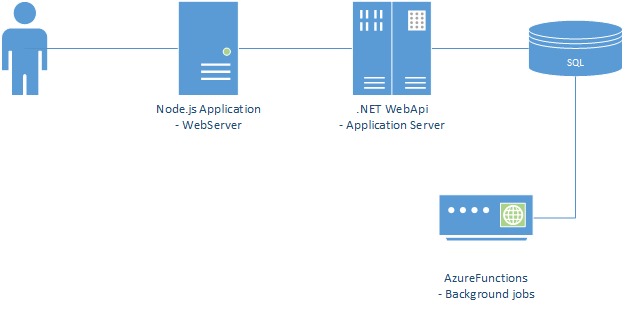
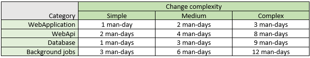
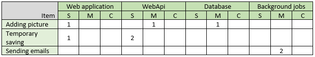
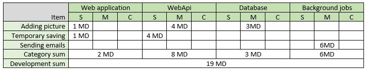

# Send rocket into space in parts - how to estimate large projects?

The job posters are full of requests for agile, scrum coaches. Now every manager, team lead position in the job poster has information about agile. Current trend is now very clear. We are trying to deliver software in small steps. We took functionality tear it apart into smallest user stories possible and finish one by one. IT commits only to the work planned for the next two weeks. 

This approach is working. Business sees how developers deliver software. IT is predictable and everyone is happy. 

### ...Until something bigger happen

You could be requested for managing a project which is much greater than you usually do and additionally you are asked to answer for simple question: how much it will cost? 
Your current agile methods are not working anymore. You cannot analyze the solution and write exact method names for every tasks. You think that need to perform one hundred sessions of estimations in one week to make estimations.

## Estimator

To meet your estimation deadline you need to use different tool. Estimator is usually an Excel spreadsheet which returns you a number of man-days which are needed to deliver functionality. It contains different conversion rate for different parts of the system. 

Having simple solution we could differentiate at least 4 categories
- WebApplication
- WebApi
- Database
- Background jobs

If the solution is more complex we could split one of the element in more gradual items like application layer, database layer and so on.

For each category we are setting up 3 complexity levels: simple, medium and complex. For each level we setup the man-days' which are needed to finish task from given category. This is in fact crucial part of the process. Setting values wrong in this place will result in some strange estimation. 

Next we create the table which will help us summarize the effort. We should have the same categories and complexity. 
We take business requirement and add rows in our table. Filling the crossing cells with amout of changes.

Lets analyze example below: we are thinking that adding picture to our application will require one simple change in the web application one medium in the webApi and one medium change in the database.
Saving form temporary on the other hand will require simple change in the web application (this is adding simple button), two simple changes in web api - this is modification of two controller methods.

If the estimated functionality is big this table could have a lot of rows.

Last step is to calculate values.

In our simple example we estimate 19 MD of development cost.

## More advanced estimator

In real situation we should take more variables into considerations:
- in example we estimated only development, probably you would like to estimate also the QA, DevOps, Management, Analyst work. Those are different categories
- to have more flexibility you could use additional level of estimation which is reuse. So you could have complex change but you will reuse it from previous change. Than estimator will reflect more reality
- estimator is used to give number in fast way. By rule it is not very accurate. You should add contingency to be sure that you will have time to finish tasks. I saw 20% as additional time buffor
- Estimator should contain more information about change like area, category, item description. If it will be missing this the next week we won't remember what it was about
