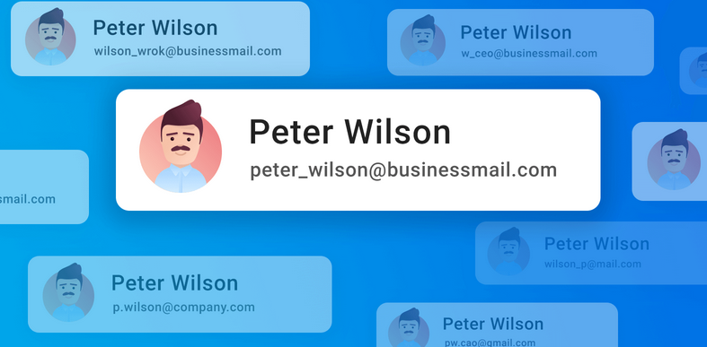
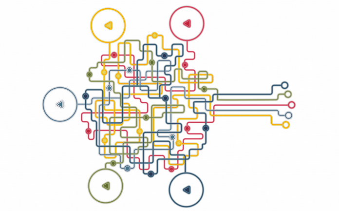
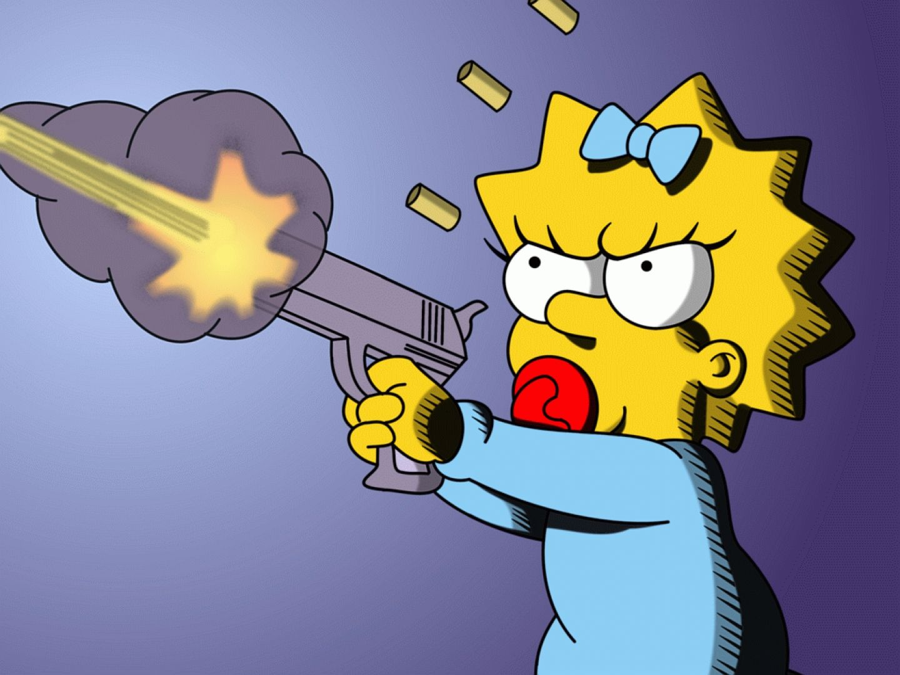
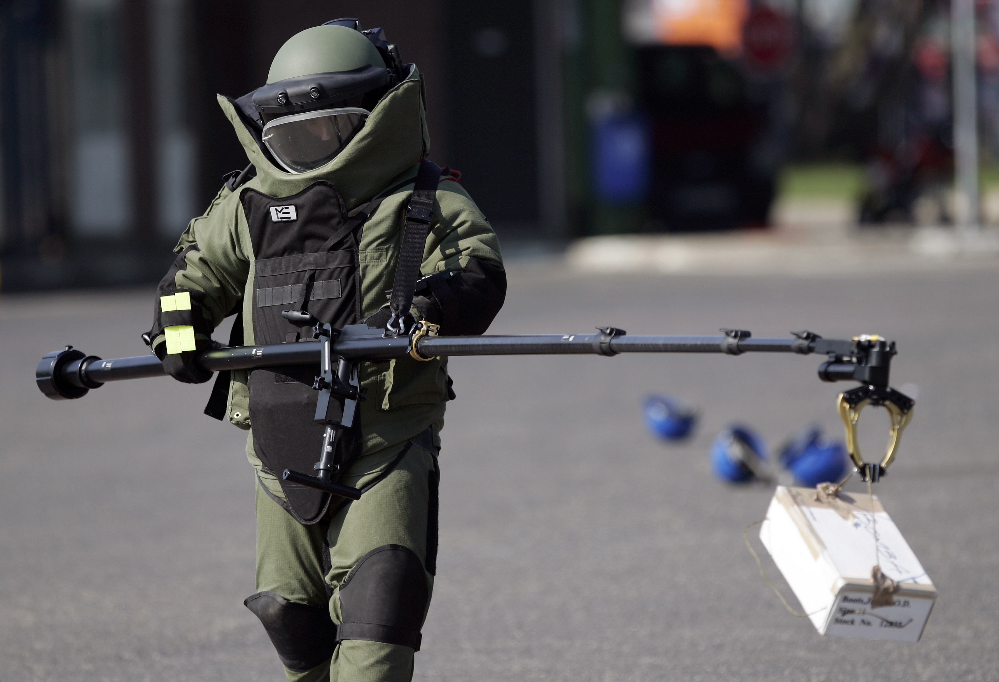
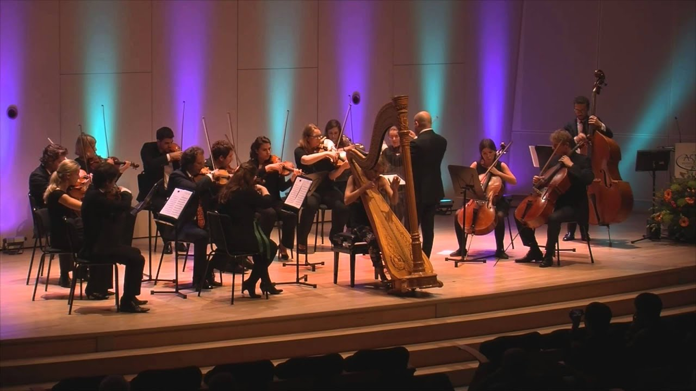
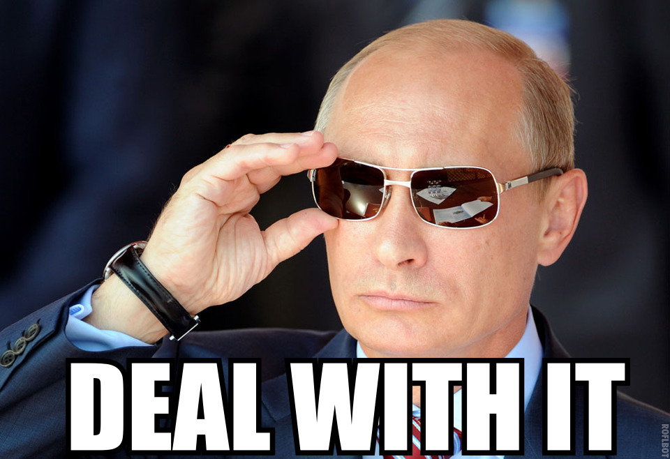
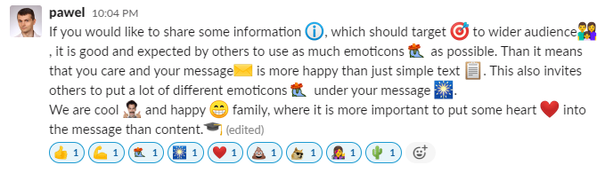

# Working with only with slack is possible but only for the best

Every company uses different ways of communication. Usually, we have:
- Phone
- E-mail
- Chat
- Video

Mostly also we are using them for different purposes. What is happening when Chat takes everything? It is an interesting experience, it has a lot of advantages, but also a lot of things which are difficult to manage. Lets review a couple of the difficult ones.

## Prod issue between pancakes and hot-dogs
In Slack, we have channels. Unusually each team has its own, we have a general channel, team-to-team channel, and so on. The funny part is that some channels are not 'topic related' but more 'people related'. For example the team channel. This means that you are sharing their information, where will you go for lunch, as also that your module on production is not working. 

Unfortunately, you need to be up to date with all dishes which bring your team to the office.

## Deals
E-mail is treated as a document. Often in e-mail results from discussions are sent. It is treated as a deal. We can save it, print it, mark it with some color, move to *deals* folder. Basically, we have a document that will allow us to prove that something was established between parties.

In Sack, everything is the conversation we could make arrangments during that, but it is extra difficult to save it for the future. You can keep this conversation open, but then in one month, you will have like thousands of open conversations that are not active anymore. Or worse if you will start the conversation again with the same people, your arrangement, will go somewhere up, which will make it much difficult to find

Other options are to open channels for every 'deal-converstion', but people are not doing it. Also, this doesn't resolve an issue with hundreds of channels

## Threads
When I working with emails, and I have two topics to the same person, I am sending them to emails. It is nice, as both topics could have different priorities. 

In Slack I would not create separate channels for those issues, so I started the conversation and write in points. Of course, we start writing messages, sometimes about one topic, sometimes about both of them. But in the end, I need to remember about both cases.

## Likes
In the Facebook world, everyone likes **likes**. Slack of course also have the ability to like someone's statement. 

It generates tree issues:
- next generation people are offended if you won't give them some smart icon when they posted something funny
- you could add icons in the conversation, and it is so easy, that people using it a lot when I read text everything is colorful and moving. It is difficult to read the content between small cars and medals which people gives for themselves
- some people accept establishment with an icon. But slack doesn't inform about adding an icon. In the email, when I ask somebody about something, the only way he to answer me is to send me an email. I will see it in my inbox and read it. In slack people just add an icon, and a couple of days later I need to go through all requests and trying to find icons!

## Traceability
When I write the email I can add anybody at any stage of the information exchange. This new participant will have a full history (maybe without attachments) of conversation. 

Slack is different. When I start the conversation with two people and I would like to add third - a new conversation is created, of course without any trace of the previous messages. So all establishments need to be repeated. 

## Not accurate recipients
When I am using e-mails, I always choose people to which it will be sent. In Slack, You won't create a channel if you would like to send information to 10 people but on the channel, you have 13. The author of the message thinks: *Those 3 people will know that I don't invite them to the meeting about the newest GeForce cards*. It is true I know, but I need to read it.

## Always something to read
On Slack, I have over 100 channels, not because I like to have a lot, but because sometimes someone publishes there important message. For me, it results in messages to be read all the time. I can postpone reading that for some time, but then I need to read a lot of messages at the same time. So I have two bad options here. Read messages all the time, and reject not important ones. Or read them in a batch later, but then it is harder.

## You would not now who wrote to you until you will open it, but then it is too late
In Outlook, I marked automatically messages from important people, my boss, my introvert friend, who is writing to me only when he had an issue, and so on.

In slack we have channels and I see only that 'somebody' write something there. I could open it and check, but then something terrible happens, the message becomes 'read' and it disappears in marked channels. 
After checking I could 'star' the message and I am doing it, but later I have stared messages about some excel, and important task to be done. Again I have not prioritized list of items...

## Conversation message exchange aka low culture of writing

Slack is chat, very fast and efficient. So why I should write exactly what I need from a given person, add pictures, and describe exactly what I am expecting. I will throw only a short request, and if he won't understand it he will ask. Unfortunately, usually, no one understood.

## Memes everywhere

For some time more and more people used memes. In slack, it is so easy that for some of the users after writing their name slack adds a custom image every time. So Conversation is looking like the message, "funny" meme, additional message, again this funny meme. 

What is more, people started to express themselves with pictures. It is something wrong? Maybe not, but I feel that sometimes I am talking with teenagers. 

## Emoticons

If you would like to share some information, which should target a wider audience, it is good and expected by others to use as many emoticons as possible. Then it means that you care and your message is happier than just simple text. This also invites others to put a lot of different emoticons under your message.
We are a cool and happy family, where it is more important to put some heart into the message than content. (edited) 

## Too easy to post
It is so easy to write on Slack, that all just throw important information there. During the last covid-remote-war-room everyone was putting important information there, message, comments, diagrams, links. It was like inside no relational database - chaos. 

# Let's chat!

Slack and chat are great it can be a live saver. Is has a web, desktop, and mobile app. But let's remember that we need to use the tool in the scenarios for which it was designed not for all situations in which it can be used. It is not always fit. 