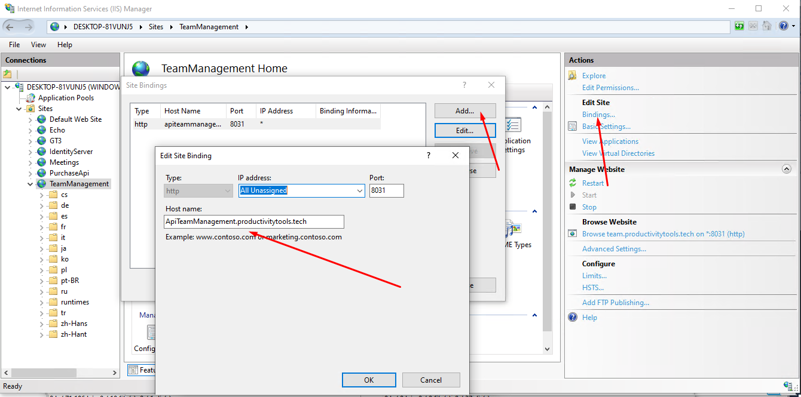
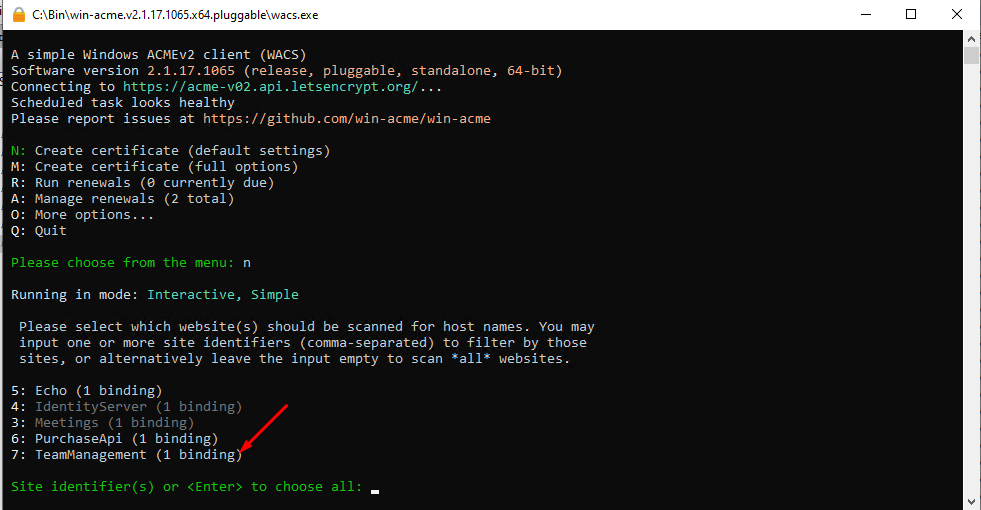
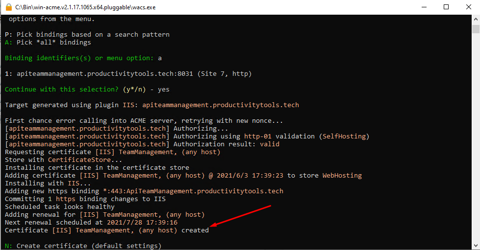
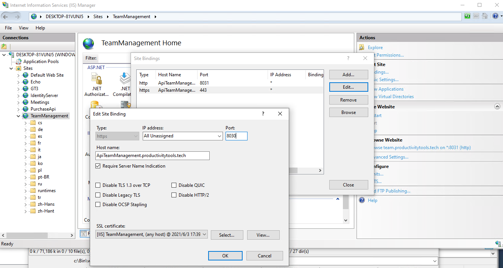

<!--Category:Article--> 
 

    <a href="http://productivitytools.tech/send-rocket-into-space-in-parts-how-to-estimate-large-projects/"><a> 
    

    

# HTTPS on IIS

<!--og-image-->

Setup SSL certificate on IIS can be cheap and easy. 

<!--more-->

## IIS
Create new website on the IIS with the http binding. Remember to add proper host name.

## DNS

Create A Record in the DNS settings.

## Server

Download win-acme from https://www.win-acme.com/. Extract it and run as administrator.

Chose **n** and checkout for your website. In my case it is TeamManagement.

After couple next obvious steps if DNS and IIS is correctly setup, we should see proper result.

Go to IIS and open Bindings. You should see new binding created. You can change the port of it to what you would like, and remove the http.

