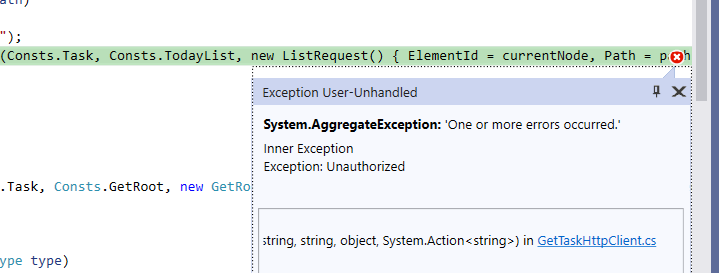

<!--Category:Article--> 
 <p align="right">
    <a href="http://productivitytools.tech/oauth-clientcredentials/"><a> 
    <a href="https://github.com/pwujczyk/ProductivityTools.Articles"></a>
</p>
<p align="center">
    <a href="http://productivitytools.tech/">
        
    </a>
</p>

# OAuth ClientCredentials

<!--og-image-->


Adding OAuth to the application is described on multiple sites, but I am missing a very simple tutorial without explaining flows. 

For application to application communication we are using **Client Credentials** flow.

<!--more-->


## Identity server

First, we need to add API definition"

```C#

public static IEnumerable<ApiResource> Apis => new List<ApiResource>
{
    new ApiResource("GetTask3.API", "API for GetTask3 Application")
};
```
Next, we need to add the client and add in the scope, the value defined earlier.

```c#
new Client
{
    ClientId = "GetTask3Cmdlet",
    AllowedGrantTypes = GrantTypes.ClientCredentials,
    ClientSecrets =
    {
        new Secret(configuration["GetTask3Cmdlet"].Sha256())
    },
    AllowedScopes = { "GetTask3.API" }
},
```

## Application

Now let's test if the communication between applications is working. Then let's break it and repair it.

### Package needed
```
microsoft.aspnetcore.authentication.jwtbearer
```

### Service
In the **void ConfigureServices(IServiceCollection services)** section

```C#
services.AddAuthentication(options =>
    {
    options.DefaultAuthenticateScheme = JwtBearerDefaults.AuthenticationScheme;
    options.DefaultChallengeScheme = JwtBearerDefaults.AuthenticationScheme;
    }).AddJwtBearer(options =>
    {
    options.Authority = "https://identityserver.productivitytools.tech:8010";
    options.Audience = "GetTask3.API";
    });
```

Be sure that you have the following middlewares in the Configure method (order is important)

```C#
app.UseAuthentication();
app.UseRouting();
app.UseAuthorization();
app.UseEndpoints(endpoints =>
{
    endpoints.MapControllers();
});
```

### Use Authentication

In the configure method.

```c#
public void Configure(IApplicationBuilder app, IHostingEnvironment env)
{
   ... 
   app.UseRouting();
   app.UseAuthorization();
   ...
}
```

### Method
Add **Authorize** attribute.

```c#
[HttpPost]
[Authorize]
[Route(Consts.TodayList)]
public ElementView GetTasks([FromBody]ListRequest request = null)
{
    ...
}
```

After this operation, you should receive 401 when calling the endpoint



## Client

Required packages
- IdentityModel

We need to send the token with each request. To generate we need to call Identity Server.

```c#
private string token;
private string Token
{
    get
    {
        if (string.IsNullOrEmpty(token))
        {
            var client = new HttpClient();

            var disco = client.GetDiscoveryDocumentAsync("https://identityserver.productivitytools.tech:8010/").Result;
            if (disco.IsError)
            {
                Console.WriteLine(disco.Error);
            }

            var tokenResponse = client.RequestClientCredentialsTokenAsync(new ClientCredentialsTokenRequest
            {
                Address = disco.TokenEndpoint,

                ClientId = "GetTask3Cmdlet",
                ClientSecret = configuration["GetTask3Cmdlet"],
                Scope = "GetTask3.API"
            }).Result;

            if (tokenResponse.IsError)
            {
                Console.WriteLine(tokenResponse.Error);
            }

            Console.WriteLine(tokenResponse.Json);
            token = tokenResponse.AccessToken;
        }
        return token;
    }
```

The last step is to add a Bearer token before calling the endpoint

```c#
client.SetBearerToken(Token);
```

After those steps application should call the service again without issues.