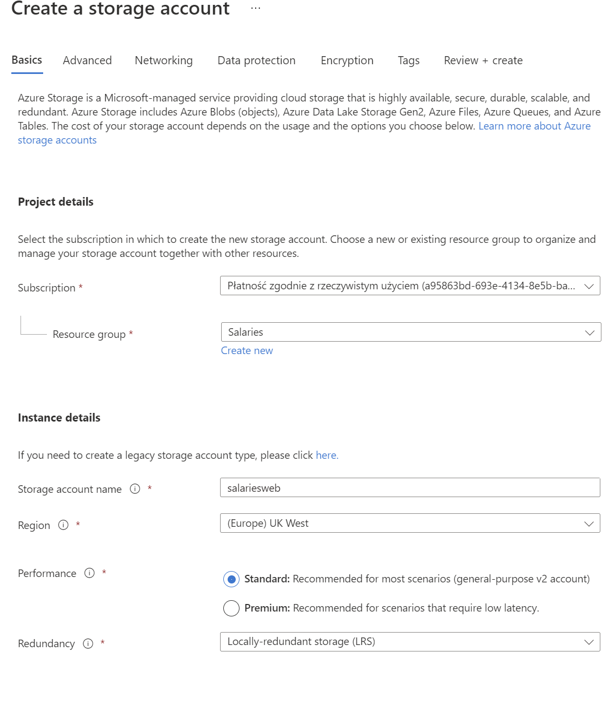

<!--Category:Article--> 
 <p align="right">
    <a href="http://productivitytools.tech/"><a> 
    <a href="https://github.com/pwujczyk/ProductivityTools.Articles"></a>
</p>
<p align="center">
    <a href="http://productivitytools.tech/">
        
    </a>
</p>

# Deploy web app to azure

<!--og-image-->


This tutorial shows how to publish web application to the azure devops.

<!--more-->

## Create storage account for the website

- Create new resource group
- Create storage account



- Enable static website


- Copy Key


## Create pipeline

- Go to Pipelines >> Pipelines
- Create Pipeline
- Github
- Node with react

```yaml
# Node.js with React
# Build a Node.js project that uses React.
# Add steps that analyze code, save build artifacts, deploy, and more:
# https://docs.microsoft.com/azure/devops/pipelines/languages/javascript

trigger:
- master

pool:
  vmImage: ubuntu-latest


steps:
- task: NodeTool@0
  inputs:
    versionSpec: '14.x'
  displayName: 'Install Node.js'

- script: |
    yarn install
    yarn run build
  displayName: 'yarn install and build'

- task: CopyFiles@2
  displayName: 'Copy files'
  inputs:
    sourceFolder: 'build' 
    Contents: '**/*'
    TargetFolder: '$(Build.BinariesDirectory)'
    cleanTargetFolder: true
- task: ArchiveFiles@2
  inputs:
    rootFolderOrFile: '$(Build.BinariesDirectory)'
    includeRootFolder: true
    archiveType: 'zip'
    archiveFile: '$(Build.ArtifactStagingDirectory)/$(Build.BuildId).zip'
    replaceExistingArchive: true

- task: PublishBuildArtifacts@1
  inputs:
    PathtoPublish: '$(Build.ArtifactStagingDirectory)'
    ArtifactName: 'drop'
    publishLocation: 'Container'
```

- Save and Run

## Release
- Start with empty job
- Add artifact (what was build from build step)
- Enable continuos deployment 


- Chose agent job and choose Agent (linux)
- Add new task


- Extract files
   - Archive file patterns */$(Build.BuildId).zip
   - Destination folder: $(Build.DefaultWorkingDirectory)/$(Build.BuildId)
- Add Azure CLI


- script type Powershell if windows, shell if linux
- script location inline


```
az storage blob upload-batch — account-name STORAGE_ACCOUNT_NAME account-key STORAGE_ACCOUNT_KEY — destination ‘$web’ — source ./

Example: az storage blob upload-batch --account-name meetingsweb --account-key XPq3uhvz+MvocsOcqa/nqViLsWgcCBdgwPTQvP7NWwV/O+iu2Fhn7KMCpawuRBizkaU3+/4OMaxiLzKBxTZw== --destination '$web' --source ./
```

- Set working directory to ```$(System.DefaultWorkingDirectory)/$(Build.BuildId)/dist```
