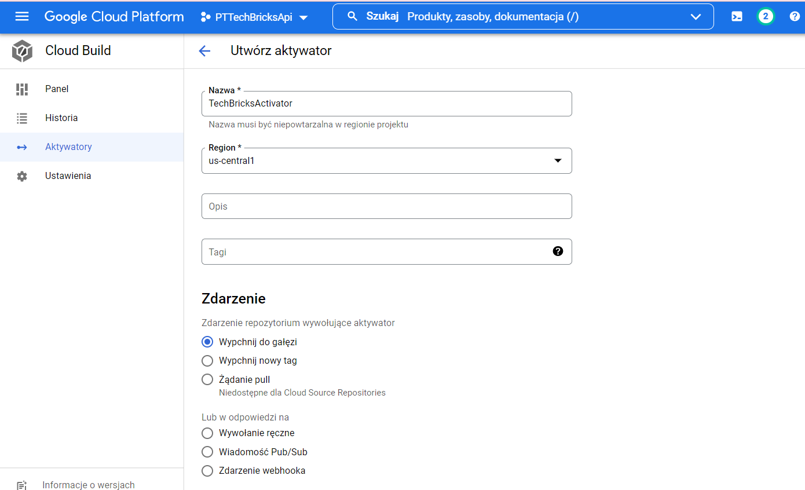
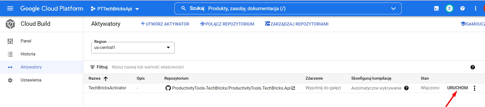
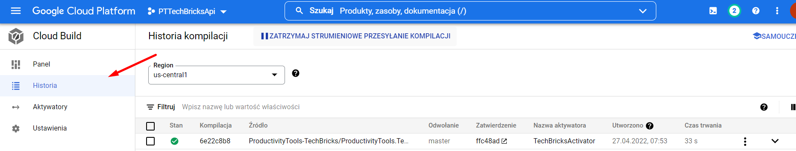
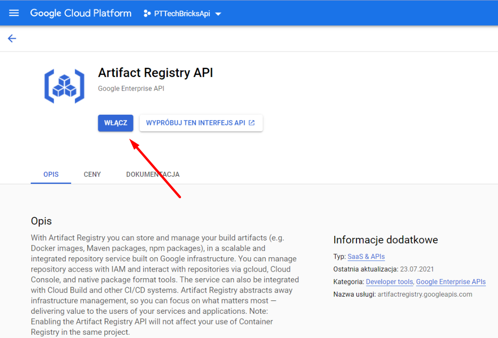
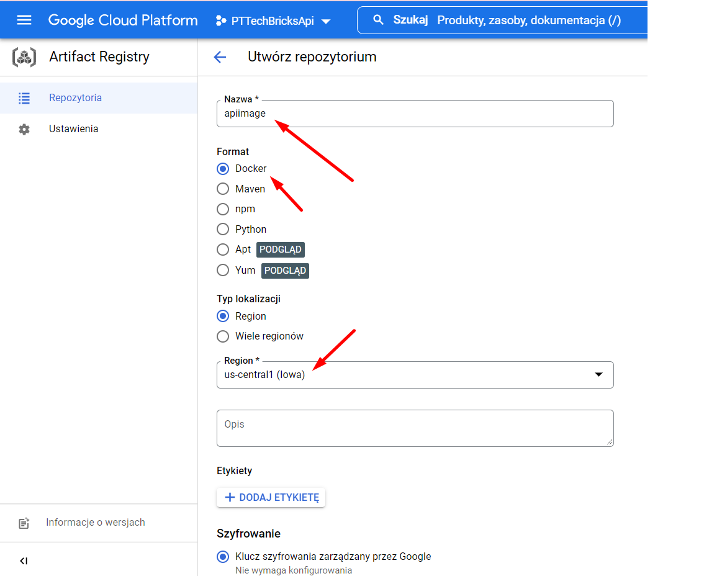
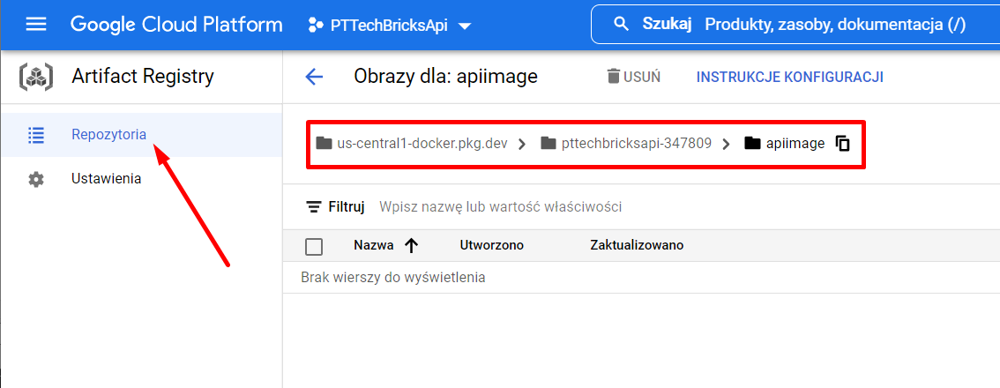

<!--Category:Article,Azure--> 
 <p align="right">
    <a href="http://productivitytools.tech/"><a> 
    <a href="https://github.com/pwujczyk/ProductivityTools.Articles"></a>
</p>
<p align="center">
    <a href="http://productivitytools.tech/">
        
    </a>
</p>

# Deploy python app app to cloud run from git repository

<!--og-image-->


This tutorial shows how to publish web application to the azure devops.

<!--more-->

Let us assume that we have the simplest python application.

main.py
```python
def print_hi(name):
    print(f'Hi, {name}')  # Press Ctrl+F8 to toggle the breakpoint.

if __name__ == '__main__':
    print_hi('PyCharm')
```
app.py
```python
from flask import Flask
from flask_restful import Api

from Resources.CardResource import CardResource

def create_app():
    app=Flask(__name__)
    register_resources(app)
    return app

def register_resources(app):
    api=Api(app)
    api.add_resource(CardResource, '/Card')

if __name__=="__main__":
    app=create_app()
    app.run(port=5000,debug=True)
```
Card resource
```python
from flask import request
from flask_restful import Resource
from http import HTTPStatus

class CardResource(Resource):
    def get(self):
        return {'data':'pawel'}, HTTPStatus.OK
```

requirements.txt
```txt
Flask==2.0.1
httpie==1.0.2
Flask-RESTful==0.3.9
Flask-SQLAlchemy==2.5.1
Flask-Migrate==2.5.2
psycopg2-binary==2.9.3
passlib==1.7.1
```

Let us add cloudbuild.yaml file with the content

```yml
steps:
# Install dependencies
- name: python
  entrypoint: pip
  args: ["install", "-r", "requirements.txt", "--user"]
```

## Cloud build
Go to Cloud build in the console. Enable API and ceate new Activator.



Run it



Go to history and validate the step



## Build step

In the build step we need to name application. Name should contain path to the **Artifact Registry** what is why we need perform couple steps before build even that right now we won't be using elements which we use.

### Enable Artificat Registry



Create a new repository for our image:




Please remember the path of our container repository. We will need it **us-central1-docker.pkg.dev/pttechbricksapi-347809/apiimage** (we even have small copy button on the right).



### Build step

```yml
# Docker Build
- name: 'gcr.io/cloud-builders/docker'
  args: ['build', '-t',
         'us-central1-docker.pkg.dev/${PROJECT_ID}/apiimage/image:${SHORT_SHA}', '.']
```
- name - image from supported [cloud builders](https://github.com/GoogleCloudPlatform/cloud-builders) which will be used
- args
  - -t - [Name and optionally a tag in the 'name:tag' format](https://docs.docker.com/engine/reference/commandline/build/)
  - docker name part 
    - us-central1-docker.pkg.dev/${PROJECT_ID}/apiimage - part which we copied before, project name was replaced with the token (this is more pro)
    - image - name of the image, could be anything
    - ${SHORT_SHA} - part after : is a tag which will help us identify the image, here is commit sha


