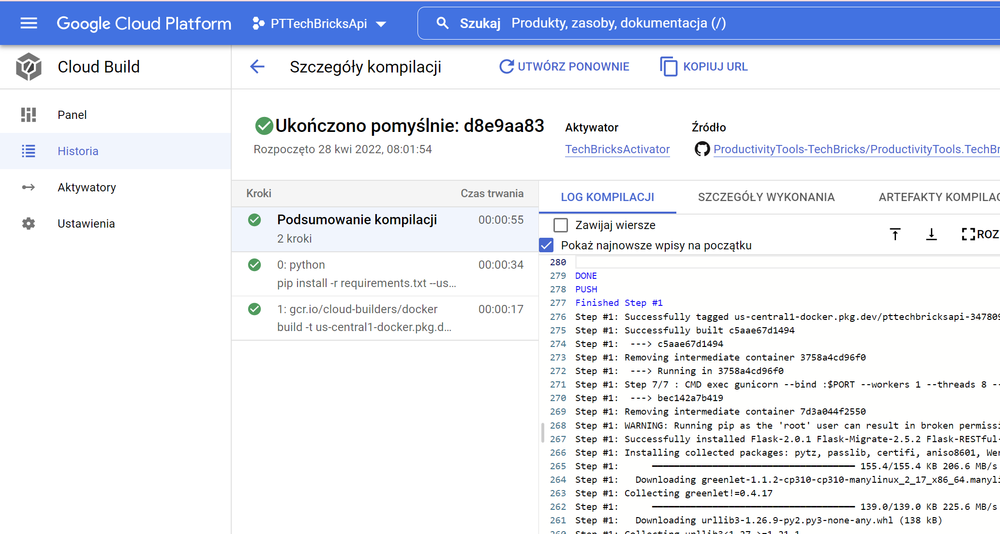
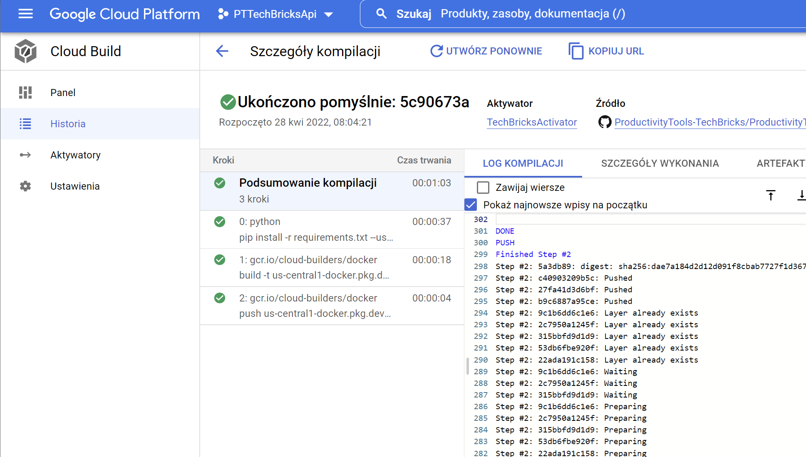
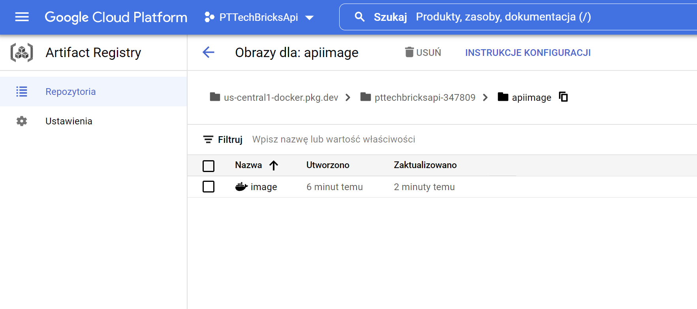
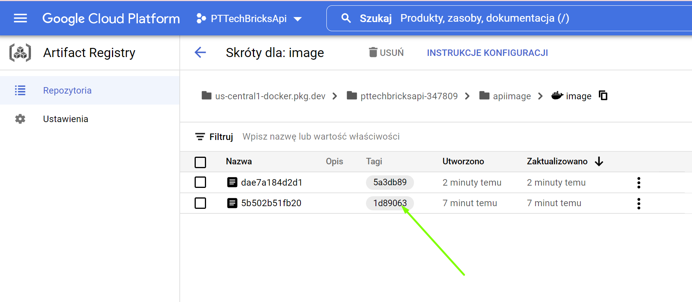
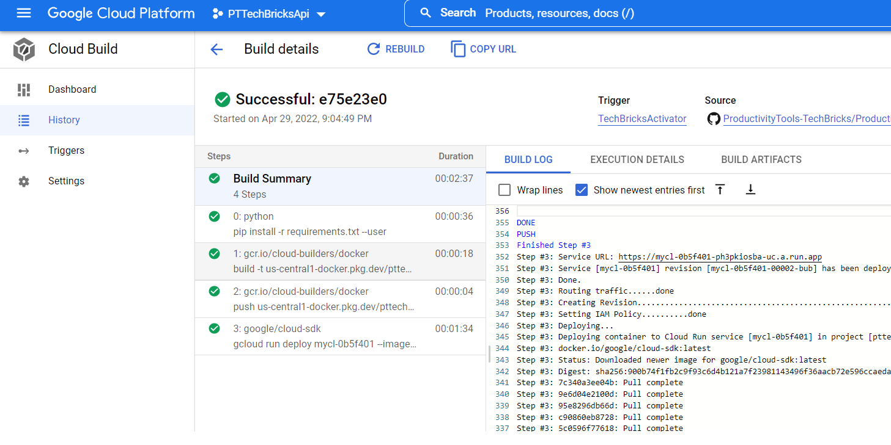
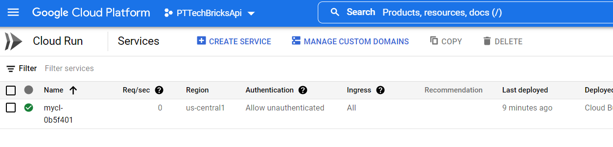
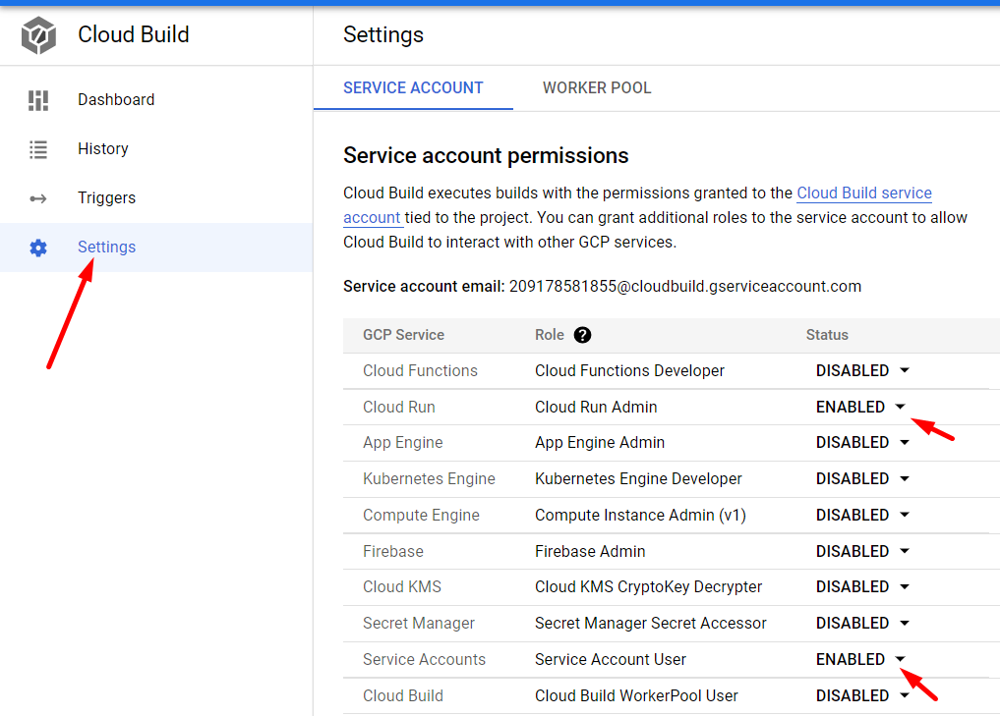

<!--Category:Article,Azure--> 
 <p align="right">
    <a href="http://productivitytools.tech/"><a> 
    <a href="https://github.com/pwujczyk/ProductivityTools.Articles"></a>
</p>
<p align="center">
    <a href="http://productivitytools.tech/">
        
    </a>
</p>

# Deploy python app app to cloud run from git repository

<!--og-image-->


This tutorial shows how to publish python web application to the **Cloud Run** using **Cloud Build**.

<!--more-->

## Application

Let us assume that we have the simplest python application.

### app.py
Please notice the ``app.run`` line. After deploying app to **Cloud Run** GCP performs health check on the port provided in the GCP config so you need to open app on this port. The easiest way to do it is to read the GCP configuration.

```python
from flask import Flask
from flask_restful import Api
import os

from Resources.CardResource import CardResource

def create_app():
    app=Flask(__name__)
    register_resources(app)
    return app

def register_resources(app):
    api=Api(app)
    api.add_resource(CardResource, '/Card')

if __name__=="__main__":
    app=create_app()
    app.run(port=int(os.environ.get("PORT", 8080)),host='0.0.0.0',debug=True)
```
### Card resource
```python
from flask import request
from flask_restful import Resource
from http import HTTPStatus

class CardResource(Resource):
    def get(self):
        return {'data':'pawel'}, HTTPStatus.OK
```

### requirements.txt
```txt
Flask==2.0.1
httpie==1.0.2
Flask-RESTful==0.3.9
```

Let us add cloudbuild.yaml file with the content

```yml
steps:
- name: python
  entrypoint: pip
  args: ["install", "-r", "requirements.txt", "--user"]
```

### Docker fle
```
FROM python:3.10-slim
ENV PYTHONUNBUFFERED True
ENV APP_HOME /app
WORKDIR $APP_HOME
COPY . ./
RUN pip install --no-cache-dir -r requirements.txt
CMD ["python", "app.py"]
```

## Cloud build
Go to Cloud build in the console. Enable API and ceate new Activator.


Run it


Go to history and validate the step


## Build step

In the build step we need to name application. Name should contain path to the **Artifact Registry** what is why we need perform couple steps before build even that right now we won't be using elements which we use.

### Enable Artificat Registry


Create a new repository for our image:


Please remember the path of our container repository. We will need it **us-central1-docker.pkg.dev/pttechbricksapi-347809/apiimage** (we even have small copy button on the right).


### Build step

```yml
## Docker Build
- name: 'gcr.io/cloud-builders/docker'
  args: ['build', '-t',
         'us-central1-docker.pkg.dev/${PROJECT_ID}/apiimage/image:${SHORT_SHA}', '.']
```
- name - image from supported [cloud builders](https://github.com/GoogleCloudPlatform/cloud-builders) which will be used
- args
  - -t - [Name and optionally a tag in the 'name:tag' format](https://docs.docker.com/engine/reference/commandline/build/)
  - docker name part 
    - us-central1-docker.pkg.dev/${PROJECT_ID}/apiimage - part which we copied before, project name was replaced with the token (this is more pro)
    - image - name of the image, could be anything
    - ${SHORT_SHA} - part after : is a tag which will help us identify the image, here is commit sha

Go to Cloud run and valide if it is working


As we can see two steps finished with sucess.



Until now we restored requirements, and we build the application. Now we need to store it into **Artifact Registry**

### Artifact Registry

We already enabled the API. Let us add new step to our yaml file. We are using the same image ('gcr.io/cloud-builders/docker') to invoke command. Our command is **push** as a parameter we are giving name of the image which we build. We are omitting the sha part as it is only a tag (metadata) to the file.
 
```yaml
## Docker push to Google Artifact Registry
- name: 'gcr.io/cloud-builders/docker'
  args: ['push',  'us-central1-docker.pkg.dev/${PROJECT_ID}/apiimage/image']
```

Let us again run the workflow. 



After sucessfull invocation go to **Artifact Registry** and check if you have your image there.



When you click on it, you can see the versions of the images. In the **Tag** column we have the sha of commit



run.services.get

 [209178581855@cloudbuild.gserviceaccount.com] does not have permission to access namespaces instance [pttechbricksapi-347809] (or it may not exist): Permission 'iam.serviceaccounts.actAs' denied on service account 209178581855-compute@developer.gserviceaccount.com (or it may not exist).

## Deploy to Cloud Run


```yaml
- name: google/cloud-sdk
  args: [ 'gcloud', 'run', 'deploy', 'mycl-${SHORT_SHA}',
          '--image=us-central1-docker.pkg.dev/${PROJECT_ID}/apiimage/image:${SHORT_SHA}',
          '--region', 'us-central1', '--platform', 'managed',
          '--allow-unauthenticated' ]
```
If all steps will finish with sucess,


you should see the new app in the **Cloud Run**



### Debbuging
The last step was most difficult for me if you face **Permission "run.services.get" denied on resource ** validate if you have correct permissions in the **Settings** enabled.



Additional resources
- I also used this [link](https://stackoverflow.com/questions/56068870/permission-error-when-trying-to-deploy-to-google-cloud-run) but I do not think it is necessary.
- [GCP doc](https://cloud.google.com/build/docs/building/build-python)

