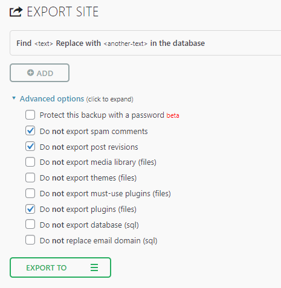
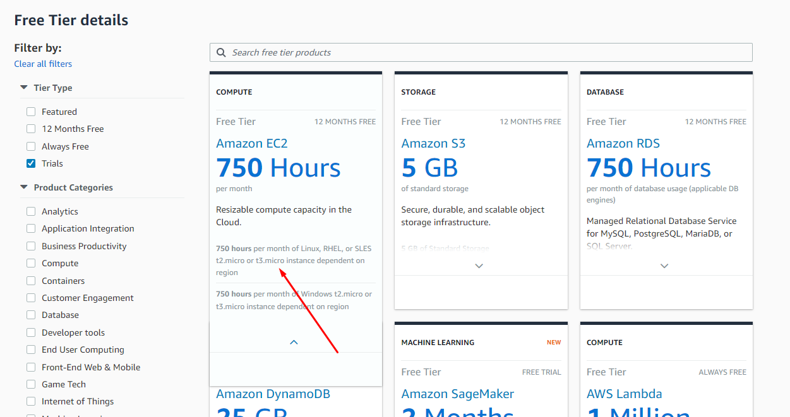
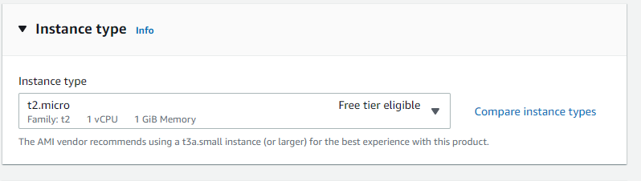
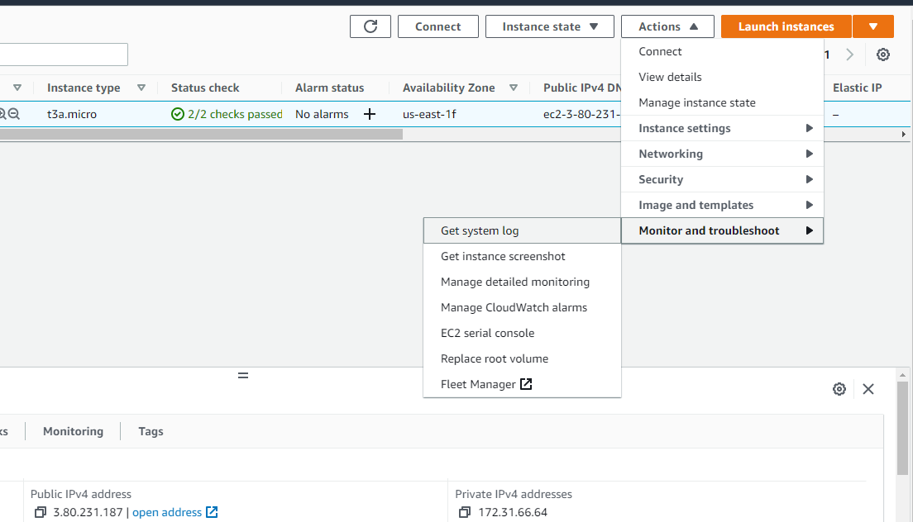
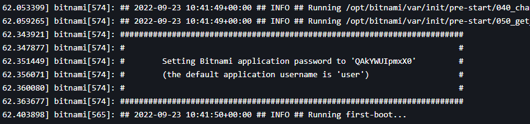

<!--Category:Article,Azure--> 
 

    <a href="http://productivitytools.tech/"><a> 
    

    

# Create wordpress page for ProductivityTools

Sometimes i need to recreate the AWS wordpress server. This tutorial sumarizes all the steps together with moving the blog.
<!--more-->

## Backup previous blog
- Update the Wordpress
- Update plugins
- Go to All-in-One WP Migration
- Choose settings
<!--og-image-->

- Export data to file

## Create AWS instance
- Fre tier currently is offered for t2.micro and t3.micro instances

- It need to be marked as Free tier eligible

- After creating isntance we can go to the /wp-admin 
- Password we can take from **Get system log**

- there we have a password

xVMbuhPPklt9

## Add plugins if required
- All-in-One WP Migration
- WP Maximum Uplad File size

## How I think I did it
UnMark only 
- Do not export themes (files) & import theme
- Do not export must-use plugins (files) 
- Do not export plugins (files) 

- Maybe copy theme

## Plugins:
- Ajax Load More

- WordPress Rest API Authentication

## Theme
- /opt/bitnami/apps/wordpress/htdocs/wp-content/themes
- /bitnami/wordpress/wp-content/themes

