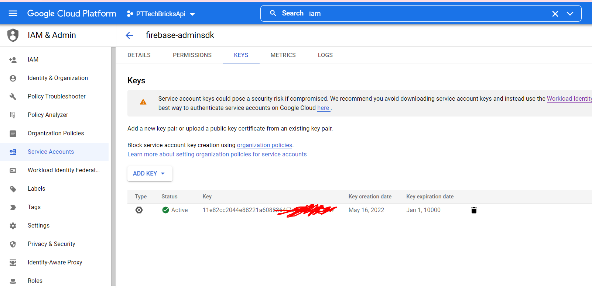

Authentication of the token is done with the firebase admin sdk.

We need to initialize it with the json file

```python
from firebase_admin import credentials, initialize_app

cred=credentials.Certificate('pttechbricksapi-firebase.json')
default_app=initialize_app(cred)
```

Then inf the Resource we can verify id token, if the token will be parsed correctly than it means that user is authenticated

For now I hadn't found better way of getting the bearer that this

```python
id_token=request.headers.environ['HTTP_AUTHORIZATION']
id_token = id_token.replace("Bearer", "")
id_token = id_token.replace(" ", "")
decoded_token = auth.verify_id_token(id_token)
```

here is the source of truth for this: https://firebase.google.com/docs/auth/admin/verify-id-tokens?hl=en#web

If we want to move app to the cloud we need to stop referencing the file in the code and use the [environment variable](https://firebase.google.com/docs/admin/setup#linux-or-macos) 

In PyCharm we can do it here:


In windows
$env:GOOGLE_APPLICATION_CREDENTIALS="D:\Bitbucket\all.configuration\pttechbricksapi-adminsdk.json"

New Service account is generated here:


List of service admin sdks are here



We also can use the manual JWT validation I was trying to use flask_of_oil for this, but failed. 
I tired with
```
   _oauth=OAuthFilter(app)
    _oauth.configure_with_jwt("https://www.googleapis.com/robot/v1/metadata/x509/securetoken@system.gserviceaccount.com","https://securetoken.google.com/pttechbricksapi-347809","pttechbricksapi-347809")
 
```