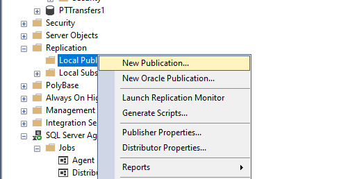
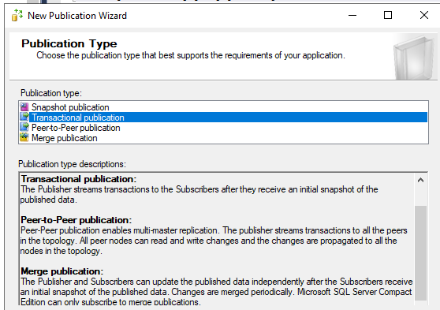
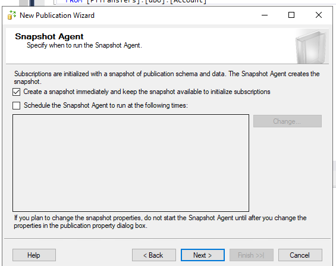
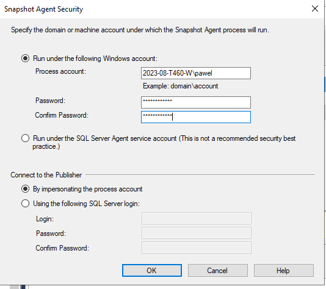
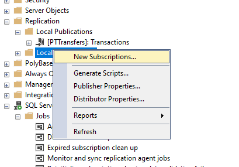
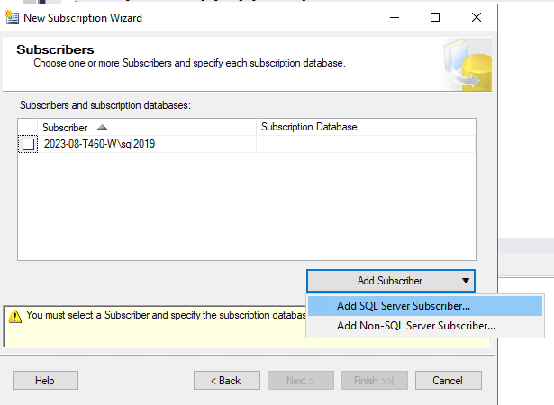
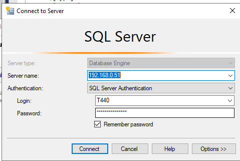
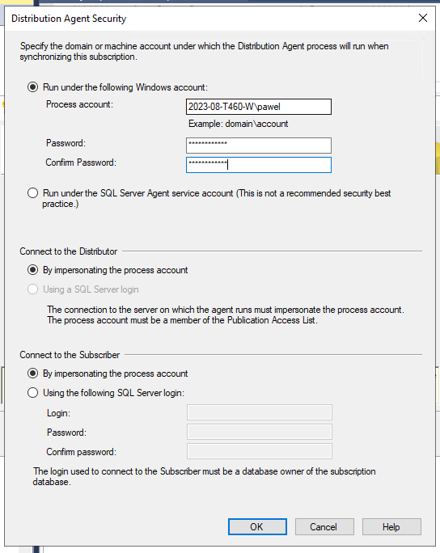

<!--Category:Article--> 
 

    <a href="http://productivitytools.tech/send-rocket-into-space-in-parts-how-to-estimate-large-projects/"><a> 
    

    

# SQL Transactional Replication

<!--og-image-->

Setup SQL Transactional replication between two servers in the same network.

<!--more-->

## Source server

The account is the most tricky one. In a tutorials in the Internet usually people use **Server agent** for me it did not work. I used my account that I am using to login.

## Still on the source server

This is also not described well in the tutorials. Very often tutorials showed how to do transactional replication on the same server - means source and destination server are the same, that does not give a lot of information how to do it. But remember you need to do those steps again on the source server. 

Address of the target server. To do it first connnect from management studio from source server to sql instance in the destination server. This will make sure that you have all ports, remote management enabled. It is also not easy step it took me couple hours, but you can find tutorials on the Internet. The main tip is to use SQL server authentication if you do not have domain, but probably you do not have. 

If you will connect directly from the management studio to remote computer it should also work here.

I needed to enable SQL authentication

Again tricky step provide the source server credentials. 

