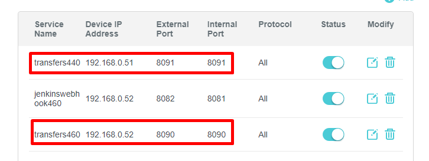

<!--Category:Article--> 
 <p align="right">
    <a href="http://productivitytools.tech/send-rocket-into-space-in-parts-how-to-estimate-large-projects/"><a> 
    <a href="https://github.com/pwujczyk/ProductivityTools.Articles"></a>
</p>
<p align="center">
    <a href="http://productivitytools.tech/">
        
    </a>
</p>

# Cheap distaster recovery

<!--og-image-->

Setup application and SQL server database replication. This describes how I setup two laptops as servers and did replication between them. I am not using them at the same time, but one is waiting **on hold** if the main one will break.
<!--more-->

## HL arch

Architecture is simple


## DNS


This normal. In the DNS I defined a host (**meetings**) that points points to the IP address of the router. I do not have external IP but it could be easily managed. 

The full address will be **meetings.productivitytools.top**. 

DNS not managing ports, this important information as we will use them later.


## Router

On router I am doing two entries for port forwarding. All configuration is important here:

- I am pointing to two servers (51 & 52)
- For each server I am using different port



## Server
On the server I have echo method

```c#
[HttpGet]
[Route("echo")]
public string echo(string name)
{
    return $"Welcome request performed at {DateTime.Now} with"+
    "param {name} on server {System.Environment.MachineName} to Application Transfers";
}
```

## Server validaton 

I have powershell script that performs call to each server separately (to each port)


```powershell
function Request {
	[cmdletbinding()]
	param([string]$address)

	Write-Output "Performing request to $address"
	$r = Invoke-WebRequest $address
	if ($r.StatusCode -eq 200) {
		Write-Host "Request to $address finished with $($r.StatusCode)" -ForegroundColor Green
		Write-Host $r.Content;
	}
	else {
		Write-Host "Request to $address finished with $($r.StatusCode)" -ForegroundColor Red
		Write-Host $r
	}
}

Request "https://meetings.productivitytools.top:8090/Meeting/echo?name=pawel"
Request "https://meetings.productivitytools.top:8091/Meeting/echo?name=pawel"
```

## Updating binaries

I defined two webhooks in github 


Each one points to the same url but different port:

- http://jenkinswebhook.productivitytools.top:8081/github-webhook/
- http://jenkinswebhook.productivitytools.top:8082/github-webhook/

This allows me to invoke two build processes if I do any commit.


## Database synchronization

I am using only one instance of the server, the second one is just waiting. If the primary one will die, I should be able to quickly switch to the backup one.

But for this I need to have database in sync. To do this I am using SQL transactional replication (I also described it on this blog)