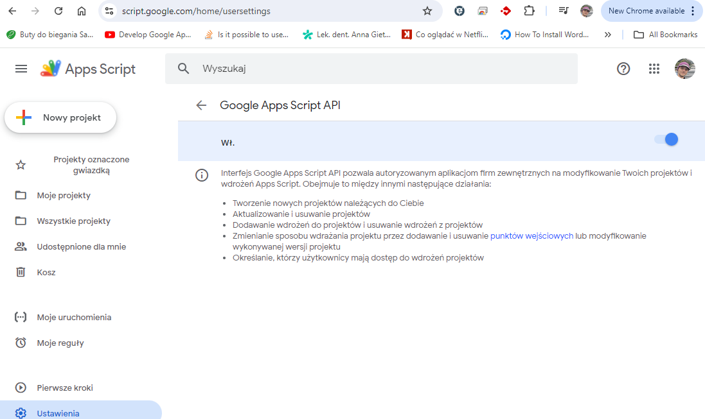

# CLAPS

<!--more-->


Open directory in the VS code and install CLASP
```
npm install -g @google/clasp
clasp -v
```

Enable API for google scripts:

https://script.google.com/home/usersettings



Copy project ID (1HVy5GD0Y4-WFLL5Zoxprk4uT4tKuepQ0vZJIJbPZeUVyVLOf-Ou4D-af)

Login to appscripts:
```
clasp login
```

```
npm init
clasp clone "1HVy5GD0Y4-WFLL5Zoxprk4uT4tKuepQ0vZJIJbPZeUVyVLOf-Ou4D-af"  --rootDir src
```
After clone .clasp.json will be placed in the /src dir. Move it to the main directory.

After changing code

```
clasp push
```


Additional
```
clasp pull
```

## Watch
```
clasp push --w
```

## Autocomplete

[link](https://github.com/google/clasp/blob/master/docs/typescript.md)
```
npm i -D @types/google-apps-script
```


## Debug
https://github.com/google/clasp/blob/master/docs/run.md
- create gcp project
- ``` clasp setting projectId <ProjectID> ```
- https://console.cloud.google.com/apis/credentials/consent?project=ptappscript
- Variables
  - Application name: PTAppScriptClaps
- casp open


clasp open --creds

```
{
  "timeZone": "Europe/Warsaw",
  "dependencies": {
  },
  "exceptionLogging": "STACKDRIVER",
  "runtimeVersion": "V8",
  "oauthScopes": [
    "https://www.googleapis.com/auth/drive.readonly"
  ]
  
}
```

## Direct invocation
C:\Users\pwujczyk\AppData\Roaming\npm\clasp.cmd pull

