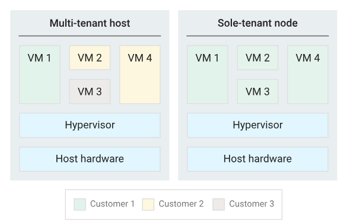

# Sole tenancy

- Gives exclusive access to the sole-tenant node - physical Computer. 
- You can create on the sole-tenant node your VMs
- You are sure that on this sole-tenant node only your VMs will be placed (no VMs of other client)

