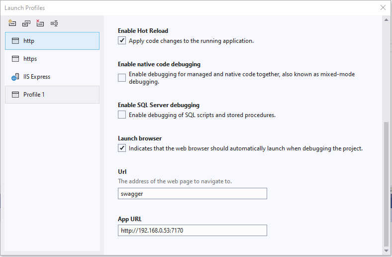
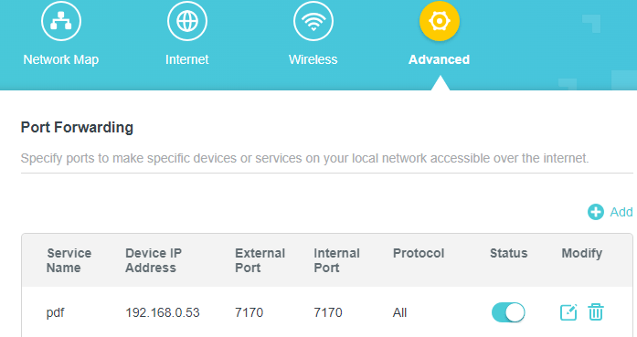
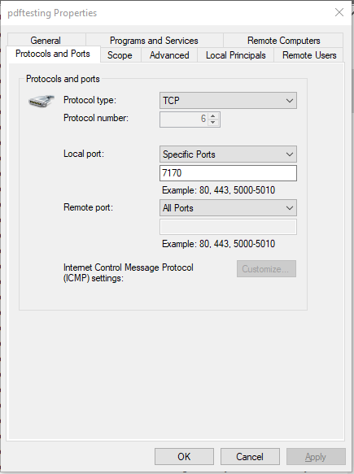
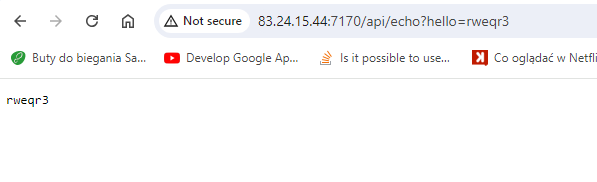

## Server configuration

- VS needs to be open with Administrative rights
- New **Lunch profile** with local ip address needs to be created

- On the Router new route needs to be added 

- New rule in firewall needs to be craeted

After all you can call the endpoint with external URL

