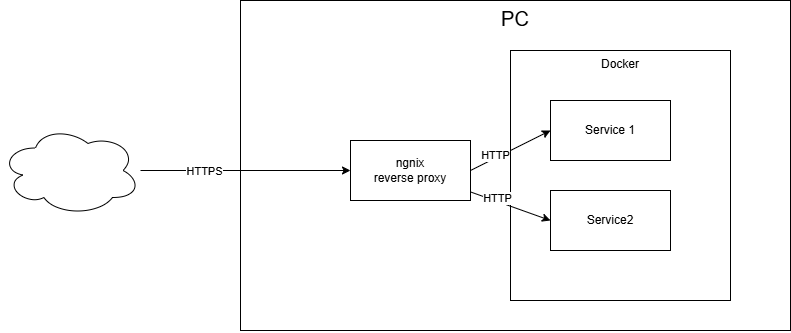
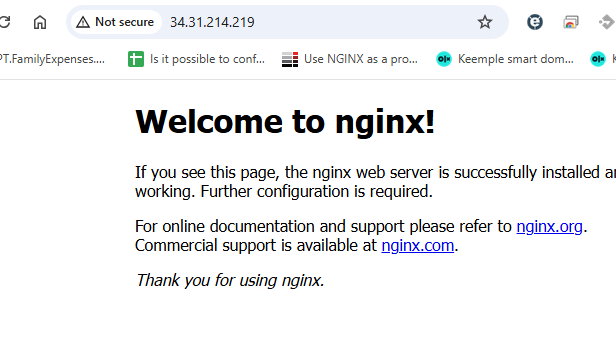
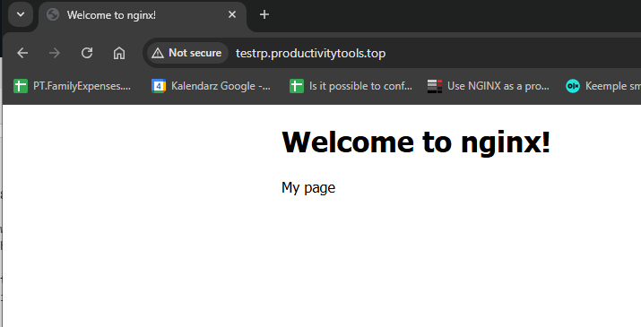
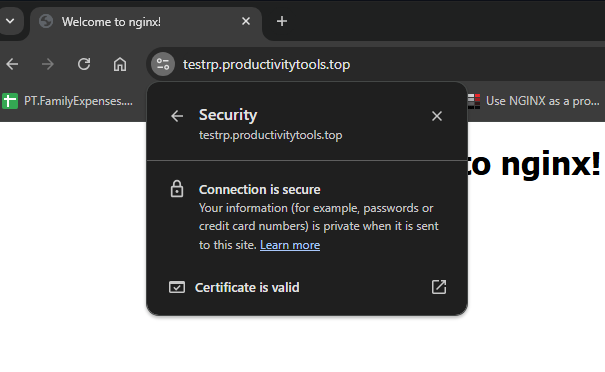
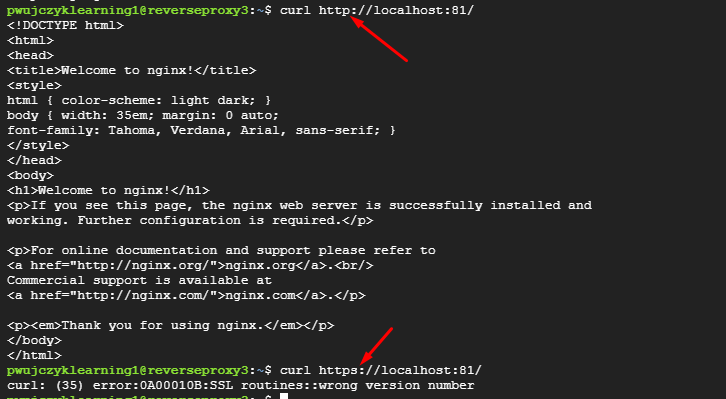
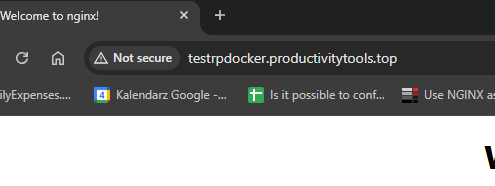
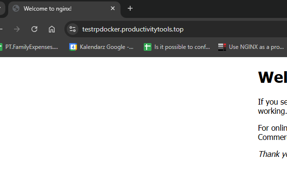

<!--Category:Article--> 
 <p align="right">
    <a href="http://productivitytools.tech/send-rocket-into-space-in-parts-how-to-estimate-large-projects/"><a> 
    <a href="https://github.com/pwujczyk/ProductivityTools.Articles"></a>
</p>
<p align="center">
    <a href="http://productivitytools.tech/">
        
    </a>
</p>

# Reverse proxy

<!--og-image-->


Setup reverse Proxy on ngnix
<!--more-->

## Source server


Why to use a reverse proxy?
- if you have multiple services on the one computer you cannot create the subhost for them, they need to be hosted on different ports (localhost:80, localhost:81 etc). This means that in the internet you also have your service under specific port like productivitytools.top:81. You can add the subhost, but still port is needed
- above also means that you cannot have two pages on the standard 80 port. 


This readme presents how to create reverse proxy that will reroute domain request to the docker one. Tutorial will also show how to setup SSL on the reverse proxy. 




Remarks:
- remember to open port on the ubuntu, that your docker image operates.
```
sudo ufw status verbose sudo ufw allow 81/tcp
```
- nginx config files
  - /etc/ngninx/conf.d - Redhat
  - sites-enabled sites-available - Debian, Ubuntu
- default page hosted by ngnix is placed sudo nano /var/www/html/index.nginx-debian.html

## Reverse Proxy and https termination

### Create VM for tests

```
gcloud compute instances create "reverseproxy" --machine-type "e2-standard-2" --image-project "ubuntu-os-cloud" --image-family "ubuntu-2204-lts" --subnet "default"
gcloud compute instsances delete reverseproxy
gcloud compute instances stop reverseproxy
gcloud compute instances start reverseproxy
```

### Install nginx

```
sudo apt-get update
sudo apt install nginx -y
curl localhost
```


----
### Create webage
[tutorial](https://www.digitalocean.com/community/tutorials/how-to-install-nginx-on-ubuntu-20-04#step-5-%E2%80%93-setting-up-server-blocks-(recommended))
- ngnix serves documents out of the directory /var/www/html for the single site
- for multiple sites we should create a structure in /var/www
```
cd /var/www/
sudo mkdir -p /var/www/testrp.productivitytools.top/html
sudo chown -R $USER:$USER /var/www/testrp.productivitytools.top/html/
sudo chmod -R 755 /var/www/testrp.productivitytools.top/html/
cp html/index.nginx-debian.html testrp.productivitytools.top/html/index.html
sudo nano /etc/nginx/sites-available/testrp.productivitytools.top
```

```
server {
        listen 80;
        listen [::]:80;

        root /var/www/testrp.productivitytools.top/html;
        index index.html index.htm;                              

        server_name testrp.productivitytools.top www.testrp.productivitytools.top;

        location / {
                try_files $uri $uri/ =404;
        }
}

```
Enable page
```
sudo ln -s /etc/nginx/sites-available/testrp.productivitytools.top /etc/nginx/sites-enabled/
sudo nginx -t
sudo nginx -s reload
```
The page should open under address. (it is not secure as it is http)



### Adding SSL to the page

```
sudo apt install certbot python3-certbot-nginx
```
check the firewall
```
sudo ufw status
```
Certbot
```
sudo apt-get install certbot -y 
sudo certbot --nginx -d testrp.productivitytools.top
```

-----
sudo systemctl status certbot.timer


## Docker behind reverse proxy
The next steps will install docker and host the page on it.
The page will be shared on http and we will access it through https terminated on reverse proxy

Install docker

```
sudo apt-get update
sudo apt-get install ca-certificates curl
sudo install -m 0755 -d /etc/apt/keyrings
sudo curl -fsSL https://download.docker.com/linux/ubuntu/gpg -o /etc/apt/keyrings/docker.asc
echo \
  "deb [arch=$(dpkg --print-architecture) signed-by=/etc/apt/keyrings/docker.asc] https://download.docker.com/linux/ubuntu \
  $(. /etc/os-release && echo "$VERSION_CODENAME") stable" | \
  sudo tee /etc/apt/sources.list.d/docker.list > /dev/null
  sudo apt-get update
sudo apt-get install docker-ce docker-ce-cli containerd.io docker-buildx-plugin docker-compose-plugin
sudo docker run hello-world
sudo docker run --rm -d -p 81:80 --name my-nginx nginx
```



### Reverse proxy configuration (route to docker)

```
cd /etc/nginx/sites-availaible 
sudo nano testrpdocker.produtivitytools.top 
```

```
 server {
        listen 80;
        listen [::]:80;

        server_name testrpdocker.productivitytools.top;

        location / {
                proxy_pass htt://10.128.0.9:81;
        }
}

```
```
sudo nginx -t
sudo nginx -s reload
```


```
sudo certbot --nginx -d testrpdocker.productivitytools.top
```

