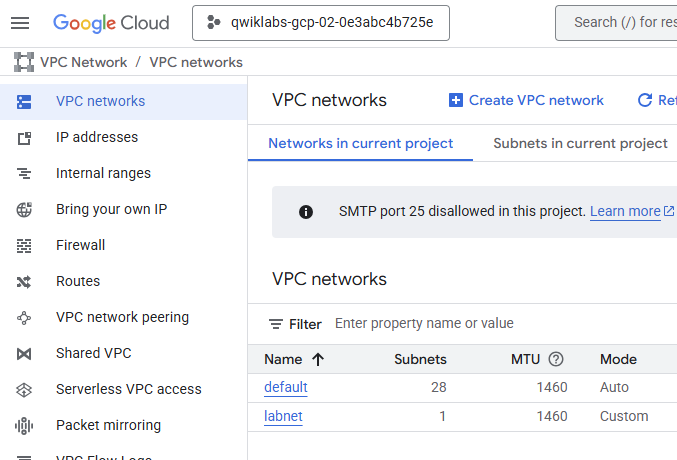

### VPC Networking Fundamentals - Virtual Private Cloud
[course](https://www.cloudskillsboost.google/focuses/1221?catalog_rank=%7B%22rank%22%3A3%2C%22num_filters%22%3A0%2C%22has_search%22%3Atrue%7D&parent=catalog&search_id=45730962)
- Each Google Cloud project has a default network with subnets, routes, and firewall rules. 
- **Routes** tell VM instances and the VPC network how to send traffic from an instance to a destination, either inside the network or outside of Google Cloud.
    - you can create a route that sends all outbound traffic to an instance configured as a NAT gateway
- By default **Firewall** has two rules that block all incoming connections and allow all outgoing connections.
  - **VPC firewall rules** are under **Firewall policies**


ICMP - The Internet Control Message Protocol (ICMP) is a supporting protocol[2] in the Internet protocol suite. It is used by network devices, including routers, to send error messages and operational information indicating success or failure when communicating with another IP address. 

### Create a VPC using Cloud Shell
[course](https://www.cloudskillsboost.google/focuses/88284?catalog_rank=%7B%22rank%22%3A5%2C%22num_filters%22%3A0%2C%22has_search%22%3Atrue%7D&parent=catalog&search_id=45731609)

basic commants
```
gcloud compute networks list
gcloud compute networks subnets list --network=labnet
gcloud compute networks subnets list --sort-by=NETWORK
gcloud compute firewall-rules list --sort-by=NETWORK

```


Create a VPC network
```
gcloud compute networks create labnet --subnet-mode=custom
```


Creating subnet:

```
 gcloud compute networks subnets create lab-sub --network labnet --region us-east1 --range 10.0.0.0/28
```

As a result new VPC network with subnet should show in the Cloud console




### Multiple VPC networks
[course](https://www.cloudskillsboost.google/focuses/43228?catalog_rank=%7B%22rank%22%3A2%2C%22num_filters%22%3A0%2C%22has_search%22%3Atrue%7D&parent=catalog&search_id=45872917)

```
gcloud compute networks create managementnet --subnet-mode=custom
gcloud compute networks subnets create managementsubnet-1 --network managementnet --region us-west1 --range 10.130.0.0/20

gcloud compute networks create privatenet --subnet-mode=custom
gcloud compute networks subnets create privatesubnet-1 --network=privatenet --region=us-west1 --range 172.16.0.0/24
gcloud compute networks subnets create privatesubnet-2 --network=privatenet --region=us-west1 --range 172.20.0.0/24

gcloud compute firewall-rules create managementnet-allow-icmp-ssh-rdp --direction=INGRESS --priority=1000 --network=managementnet --action=ALLOW --rules=icmp,tcp:22;tcp:3389 --source-ranges=0.0.0.0/0 --enable-logging

 gcloud compute firewall-rules create privatenet-allow-icmp-ssh-rdp --direction=INGRESS --priority=1000 --network=privatenet --action=ALLOW --rules=icmp,tcp:22,tcp:3389 --source-ranges=0.0.0.0/0 --enable-logging

 gcloud compute instances create privatenet-vm-1 --zone=us-west1-a --machine-type=e2-micro --subnet=privatesubnet-1
```

Note: the comma separated rules do not work the error: ERROR: (gcloud.compute.firewall-rules.create) Firewall rules must be of the form PROTOCOL[:PORT[-PORT]]; received [imcp tcp:22 tcp:3389].

### VPC Network Peering
[course](https://www.cloudskillsboost.google/focuses/963?catalog_rank=%7B%22rank%22%3A1%2C%22num_filters%22%3A0%2C%22has_search%22%3Atrue%7D&parent=catalog&search_id=45875444)

Network Peering allows private connectivity across two VPC networks regardless of whether or not they belong to the same project or the same organization.
VPC Network Peering allows you to build SaaS (Software-as-a-Service) ecosystems in Google Cloud, making services available privately across different VPC networks within and across organizations, allowing workloads to communicate in private space.

qwiklabs-gcp-04-62d26de79936 - A

```
gcloud compute networks create network-a --subnet-mode custom
gcloud compute networks subnets create network-a-subnet --network network-a --range 10.0.0.0/16 --region us-west1
gcloud compute instances create vm-a --zone us-west1-c --network network-a --subnet network-a-subnet --machine-type e2-small
gcloud compute firewall-rules create network-a-fw --network network-a --allow tcp:22,icmp
```


### Network Security Learning Path > Networking in Google Cloud: Fundamentals > VPC networking Fundamentals

- Multiple network interfaces assigned to one VM
  - When NIC is assigned to the VM it cannot be removed
  - NIC can be configured only during VM creation
  - Each NIC needs to be in a different network
  - The network IP ranges cannot overlap

### Network Security Learning Path > Networking in Google Cloud: Fundamentals > Sharing VPC Networks

VPC network peering
- Two pairs needs to be created from network a to b and form b to a
- In the past VPN was used to connect two networks
- Only directed peered network can communicate, connection cannot be traversed through peered connected


We have two options to share the network
- Shared VPC - inside organizatoin
- Netwrok peering - across organizatoin