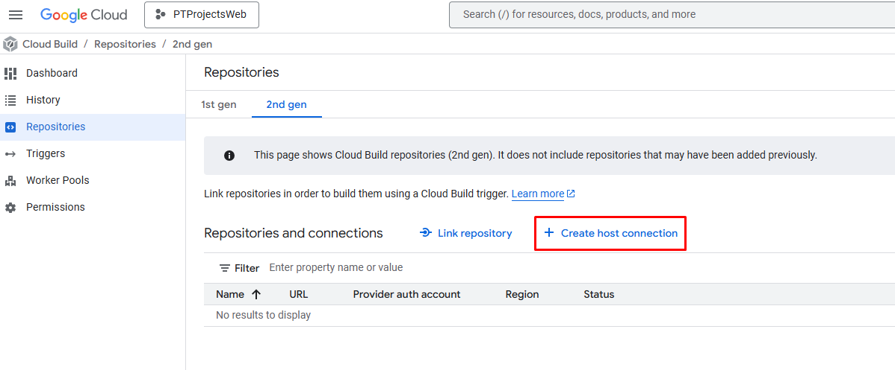
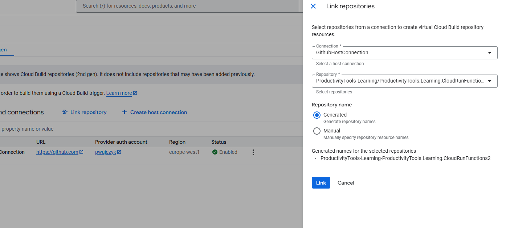
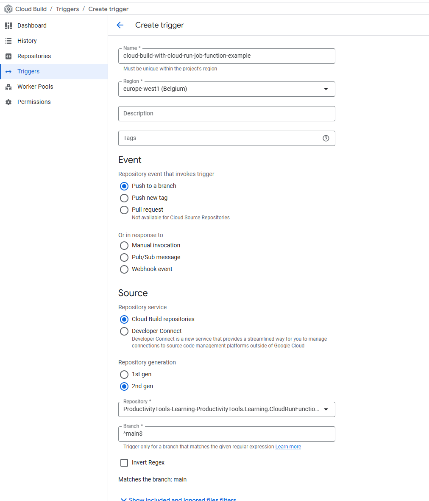

# Set Cloud build with Cloud run Job function 

## Application
Cloud Run Job is a simple console program application.

```
// See https://aka.ms/new-console-template for more information
Console.WriteLine("Job starting...");

// Access environment variables if needed
string? value = Environment.GetEnvironmentVariable("MY_ENV_VAR");
if (!string.IsNullOrEmpty(value))
{
    Console.WriteLine($"Found environment variable: {value}");
}

// Simulate some work
Console.WriteLine("Processing data...");
await Task.Delay(2000); // Simulate asynchronous work

Console.WriteLine("Job completed successfully.");
Environment.Exit(0);
```

To deploy application we will need ```cloudbuild.yaml``` file to be placed in the main directory of the application.


## Cloud build 
There is no option to deploy application automatically after code push similar to the cloud run function (http). To do that Cloud build with the yaml needs to be used.

### Repositories 2nd generation

Create host connection.

- Encryption field is optional.



Link repository



Craete trigger



