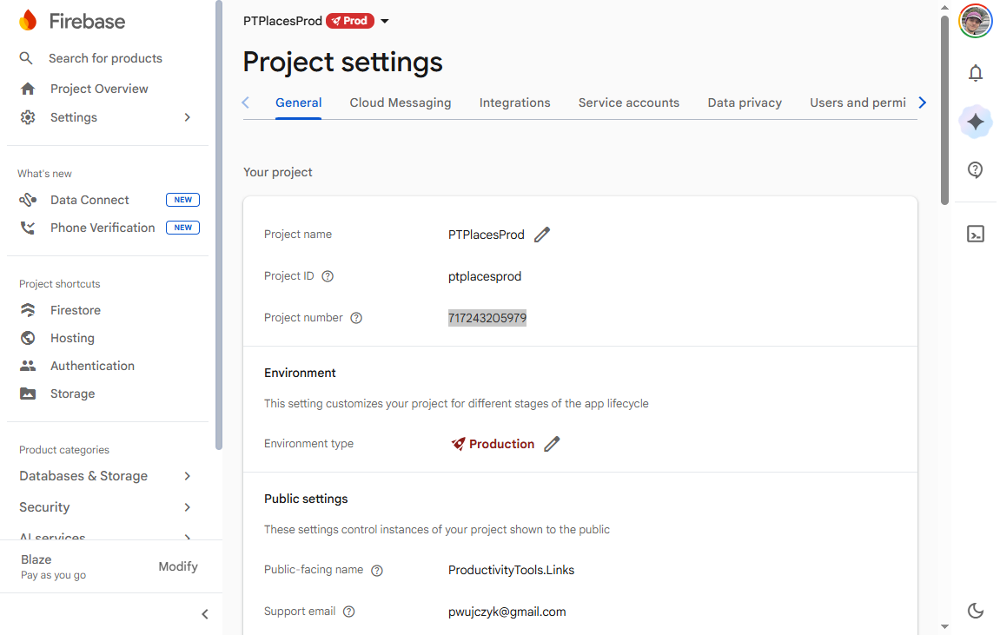
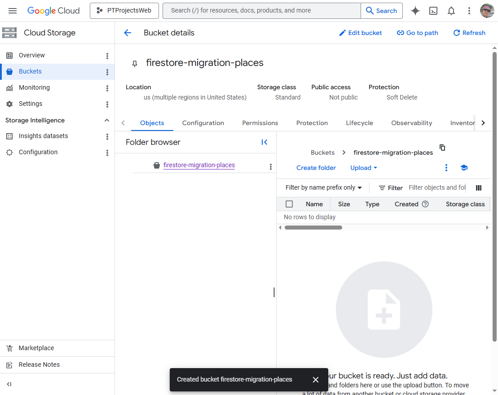
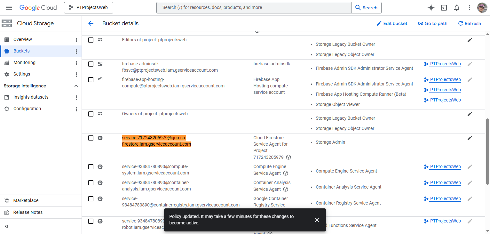
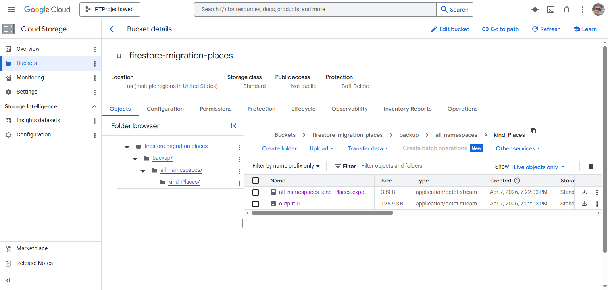

# Move Firestore databse between projects

Moving Firestore databse from one Firebase project to another.

<!--more-->


Go to settings of the Firestore to the **General** tab, get the **Project number** id (717243205979)



Create a new Bucket in the Cloud storage in the target project.



Go to the bucket details and Grand access to the special Service account checked Storage Admin permission. Service account is named service-PROJECT_NUMBER@gcp-sa-firestore.iam.gserviceaccount.com. In our example: service-717243205979@gcp-sa-firestore.iam.gserviceaccount.com



Execute command:
```
gcloud config set project ptplacesprod
gcloud firestore export gs://firestore-migration-places/backup --collection-ids=Places
```
Validate if bucket contains data

